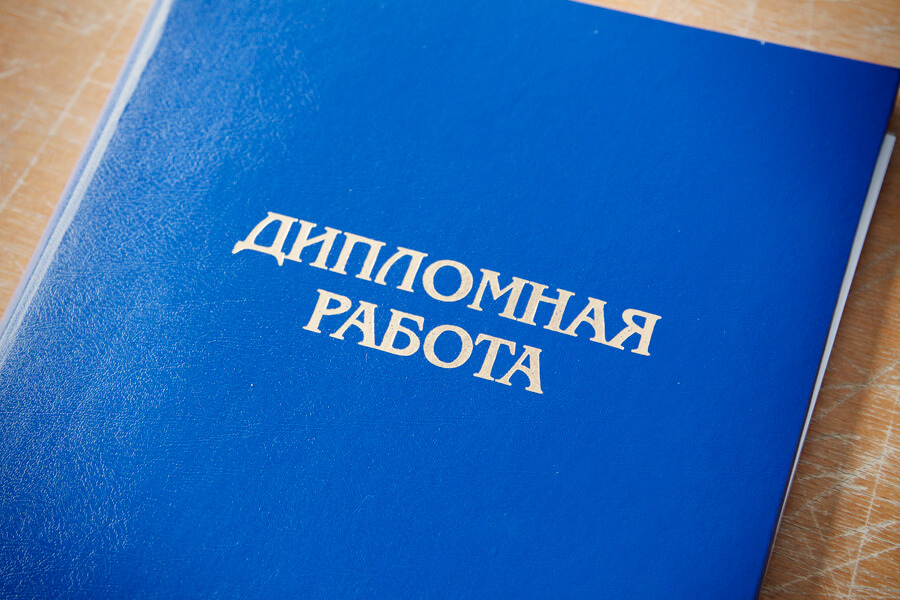

В списке вещей, которые обязательны к выполнению для каждого студента, есть итоговый пункт — **защита диплома**. И таки я его выполнил, причем на самый высокий балл, несмотря на волнение и предвзятость к моему диплому со стороны некоторых преподавателей.

Перед тем, как идти защищать диплом, я специально изучил множество источников, которые дают полезные советы по процедуре защиты. Мне они пригодились, поэтому делюсь ими с вами.
<!--more-->

Начну с известного поста на стене вконтакте одного из наших преподавателей **Кирилла Андреевича Суркова**. Ниже приведены выжимки из [текста](https://vk.com/kirill.surkov?w=wall4464716_2314) с максимальным сохранением авторского изложения.

> Памятка студенту на защите дипломного проекта:
>
> 1\. Войдите в аудиторию, передайте бумаги секретарю, а записку — председателю комиссии. Скажите коротко «здравствуйте», адресованное всем членам комиссии. Встаньте возле плакатов и спокойно дожидайтесь, пока председатель комиссии не предоставит вам слово. Больше не здоровайтесь и не делайте обращений «уважаемые члены экзаменационной комиссии». Сразу переходите к сути дела.
>
> 2\. Выступление следует построить так, чтобы оно содержало ответы на три ключевые вопроса: Что? Зачем? Как? Именно в такой последовательности. Сначала надо сказать о том, ЧТО было создано. Понятно, что это какое-то программное средство. Надо объяснить, что за программное средство было создано. Сделать это лучше всего через пример практического применения этого программного средства. Таким образом вы ответите на вопрос, ЗАЧЕМ вы его создали. И наконец, надо объяснить, КАК оно устроено. Закончить следует КОЛИЧЕСТВЕННЫМИ и КАЧЕСТВЕННЫМИ результатами применения программного средства. Количественные результаты должны быть ИЗМЕРИМЫМИ. Помните, что наука начинается там, где начинаются измерения.
>
> 3\. Обязательно следует сказать о том, как тестировалось программное средство. Надо понимать, чем надежность отличается от отказоустойчивости, и быть готовым ответить на дополнительные вопросы по надежности.
>
> 4\. Следует вплетать плакаты в выступление. Пусть указка легко касается нужных блоков во время повествования. Постарайтесь сделать так, чтобы подход к плакатам не выглядел как подход к отдельному тяжелому снаряду, который берется с третьей попытки. На плакатах не застревайте на мелочах. Важно дать общую картину, показать масштаб своей работы.
>
> 5\. Не следует использовать кальку с английского языка. Речь должна быть очищена от примесей. Не апеллируйте как чему-то общеизвестному, к теоремам и формулам, о которых члены комиссии могут не знать. Члены комиссии могут подумать, что из них лепят идиотов.
>
> 6\. Следите за своей речью. Не должно быть слов-паразитов и паразитных звуков. Говорите спокойно и уверенно, но не развязно. Уверенность не должна переходить в назидательность.
>
> 7\. Ясно и четко представляйте себе ЗНАЧЕНИЕ и ПОЛЬЗУ созданного вами программного средства. Донесите их до членов комиссии, чтобы те подумали — «он сделал полезную и экономически обоснованную вещь».

* * *

Так выглядит защита диплома со стороны государственной экзаменационной комиссии. Следующие **советы** выстраданы опытом меня и сдававших диплом годами ранее.

1. Внимательно и корректно оформляйте **список литературы**. Вообще, чем больше книг и научных статей, а не ссылок, указано в вашем списке, тем серьезнее выглядит ваша работа. Причем расширить этот список довольно просто: вбейте в Википедии ключевое слово, связанное с каким-либо разделом диплома и пролистайте страницу вниз — вуаля, готовые источники.

2. Если вы сдаете диплом на кафедре ПОИТ, тщательно выверяйте текст работы на наличие слов «_надежность_», «_защищенность_», «_стандартизация_», «_семантика_» и прочих, которые входят в содержание дисциплин, преподаваемых членами комиссии. Если нашли подобное слово — ищите его определение в конспектах или методичках (но не в Интернете) и заучивайте. Преподаватели хотят слышать только те определения, которые они лично давали под запись.

3. Если вы защищаете технический диплом, добавьте в выступление **метрики** и **количественные характеристики** — что-то, что можно измерить. Наговорить воды можно много, но только конкретные числа и измерения смогут доказать комиссии, что ваш диплом чего-то стоит.

4. Не меньше десятка раз **отрепетируйте** свою защиту с плакатами и указкой. Только так вы сможете замерить время на защиту и проанализировать свой доклад на наличие воды и непонятностей. Лучше записывать себя на диктофон или выступать перед товарищами. Пункт обязателен для тех, у кого очень маленький опыт публичных выступлений.

5. Купите на защиту **хорошие кнопки для крепления** плакатов. Увы, кнопки советского образца легко отваливаются прямо посреди защиты, что сокращает время на выступление и дразнит терпение членов комиссии.

6. Не выносите на плакаты экранные формы. Этим никого не удивить, даже если у вас самый красивый в мире интерфейс. Увы, метрик, определяющих красоту интерфейса, объективно быть не может. Лучше покажите какую-либо **математическую модель**, диаграмму Ганта или круги Эйлера, которые покажут, что именно привнесла в мир ваша работа.

7. Будьте **уверенными в себе**. Любая неуверенность в связке с волнением приведет к тому, что вы не сможете однозначно ответить на вопросы комиссии, начнете путаться и снизите этим итоговый балл. Я сам отвечал на вопросы то, что первое приходило в голову, причем с абсолютной уверенностью в голосе — даже неверные ответы не привели к снижению балла.

8. Обязательно обзаведитесь **актом о внедрении**. Это автоматически повышает итоговый балл. К тому же готовится он довольно просто, мало какой работодатель откажет.

9. **Не шумите** под дверью кабинета, где проходит защита. Даже самые звукоизолирующие двери не справляются с гомоном дипломников под дверью. И весь этот шум слышен как защищающемуся, так и комиссии. Поставьте себя на место докладчика, к тому же это рано или поздно произойдет.

10. Во время выступления смотрите не в потолок, а на членов комиссии. Они целый день пытаются поймать взгляды докладчиков, не недооценивайте важность невербального общения. Просто взглянув в глаза собеседника, вы уже станете ему немного ближе. Да, не забывайте **улыбаться**. Суровые программисты с угрюмыми лицами не вызывают желания повышать итоговый балл диплома.

11. Не используйте в докладе выдержки из разделов об охране труда и экономическом обосновании. Никому в комиссии это не интересно. Только драгоценное время потеряете.

На самом деле, если написать диплом полностью и самостоятельно, защита проходит просто, потому что сама собой появляется уверенность, а знание диплома позволит выцепить в нем лучшее для доклада.

Надеюсь, эти советы помогут вам подготовиться к защите диплома и получению хорошей оценки. Если это так, то я не зря потратил время на написание поста :)
