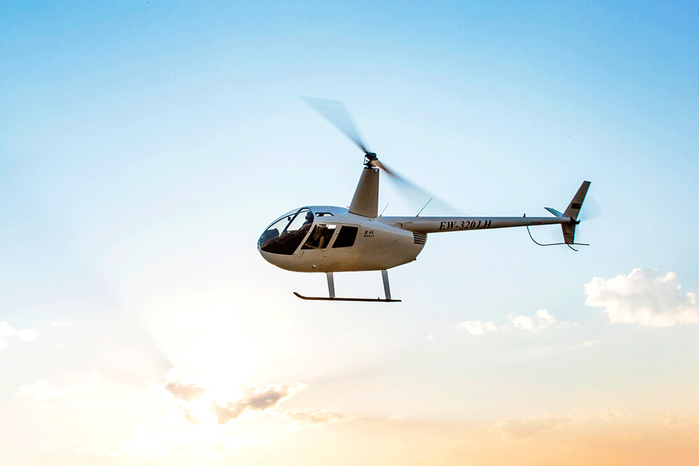
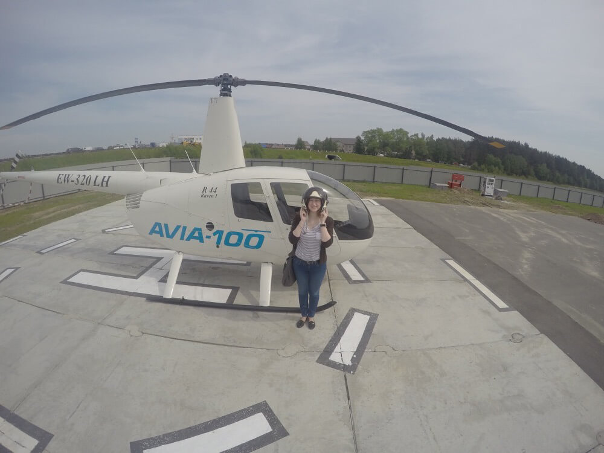
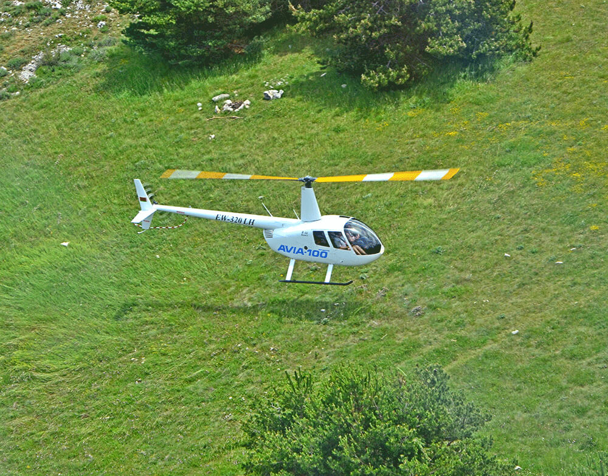

Всего [300 лет назад](https://ru.wikipedia.org/wiki/%D0%9C%D0%BE%D0%BD%D0%B3%D0%BE%D0%BB%D1%8C%D1%84%D1%8C%D0%B5%D1%80) человек мог только мечтать о полете. Воздух будоражил умы изобретателей как последняя непокоренная стихия. Теперь же самолеты, вертолеты, воздушные шары вряд ли могут кого-то удивить.

Могут. Решив порадовать свою Иру, купил на [daroo.by](http://daroo.by) сертификат на [полет](http://daroo.by/polet-na-vertolete-robinson-r44.html) на вертолете **Robinson R44**. И не прогадал.
<!--more-->

Хоть сертификат я подарил еще в марте, полетать удалось только в мае. Заранее созвонились с вертолётным клубом **«Аэро-100»**, где нам очень вежливо объяснили, как до них добраться. Если кого-то заинтересует, то сам клуб находится недалеко от супермаркета «Гиппо» за МКАД-ом, остановка «Боровая». На карте найти их несложно.

Погода в тот день стояла шикарная. Тепло и солнечно, воздух приятный. И добрались довольно быстро. Было нас трое: я, Ира и Аня. Да-да, с девчонками полетать решил. Шутка. Решал не я ведь, кто полетит.

Приехали заранее, поэтому приятную девушку-инструктора пришлось подождать в офисе. Атмосфера в офисе, кстати, шикарная. Повсюду атрибутика пилотная, шлемы разные, костюмы, фотографии. Сам пилот — веселый и приятный седой мужчинка — не давал нам скучать.

Приехала девушка-инструктор, рассказала нам о технике безопасности, подписали бумажки всякие о том, что поняли и приняли. Да, запомните, вертолет можно обходить только спереди, выходить из него тоже нужно только вперед, если не хотите себе эффектную стрижку _"всадник без головы"_ в исполнении задних лопастей получить. Благо, инструктор страхует.

Перед началом полета нам рассказали немного о самом вертолете. **Robinson R44** — самая распространенная гражданская модель. [Стоимость](http://avia-100.by/services/sell/) его — «всего» около $450.000\. Вот только растаможка и прочие радости доставки такого агрегата в Беларусь — еще 50% стоимости сверху. Самолет, кстати, дешевле приобрести и доставить. Ухаживать за вертолетом нужно постоянно, без техосмотра полеты запрещены. Ну и пилотом стать — тоже уйму средств потратить нужно. Кстати, клуб этот проводит соответствующую подготовку с выдачей сертификатов, если кому интересно.

Информация о вертолете получена, фотографии перед полетом на память в шлемах и без сделаны — и мы уже готовы взлетать. Хотел заснять все на GoPro соседа, да вот только перед самым стартом камера сия заморская накрылась. Пришлось снимать на телефон, потому извините за качество видео заранее.

<iframe width="800" height="450" id="youtube_iframe" src="https://www.youtube.com/embed/roSOiZiWiio?feature=oembed&amp;enablejsapi=1&amp;origin=https://safe.txmblr.com&amp;wmode=opaque" allowfullscreen frameborder="0"></iframe>

Видео, увы, не передает тех ощущений, которые были внутри кабины.

Во-первых, отчего-то никакого страха высоты не было. Как будто в автомобиль сел и поехал, вот только дорога под тобой уж больно далеко. Возможно, опыт пилота способствовал гладкому полету.

Во-вторых, так здорово наблюдать за землей вдалеке! Машинки маленькие такие, коровки игрушечные пасутся, домики крохотные — вид впечатляющий.

В-третьих, когда пилот поворачивал вертолет на 45 градусов и горизонт был ну очень сильно заваленный, организм тихо сходил с ума, ибо привык к ровной линии горизонта, а не сумасшествию.

В-четвертых, прикольно слушать переговоры пилота и диспетчерской. Во время полета мы еще над военной территорией пролетали, так подслушали парочку негражданских разговоров.

Летали мы в общей сумме 15 минут, и этого, в принципе, хватает, чтобы насладиться полетом сполна. **Впечатления — супер!** Полетал бы еще, и пилотом бы хотелось попробовать стать. Все-таки великая сила — покорение воздуха. Вроде, в металлическом корпусе массой не в один центнер находишься, а все равно в воздухе висишь, высоко над землей.

Девчонкам полет тоже понравился. Парни, захотите порадоваться сами и порадовать своих девушек — подарите им полет. Впечатлений хватит надолго.

А я, тем временем, добавил еще один выполненный пункт в копилку [100 вещей, которые следует сделать в жизни](http://dark-mefody.tumblr.com/100vkssvzh). А как идете к выполнению этого списка вы?
