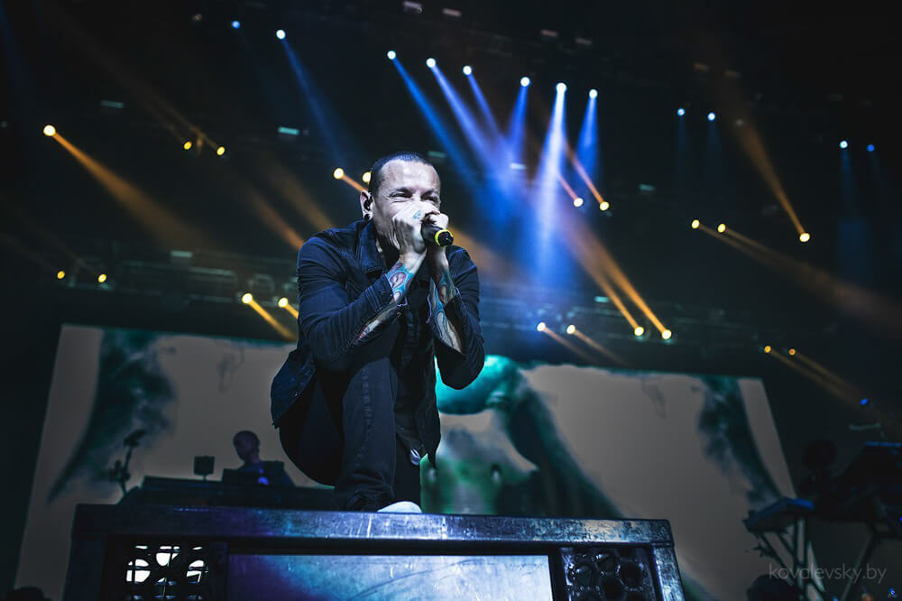

27 августа — в этом году это один из самых важных дней для фанатов **Linkin Park** в Беларуси. Почему? Да потому, что группа в полном составе в первый раз приехала со своим концертом в Минск.

<!--more-->

Анонсировать это мероприятие начали еще в [марте](http://afisha.tut.by/news/kaleidoscope/437776.html). Сервисы онлайн-продажи билетов делали рассылки каждую неделю о _"специальном предложении"_, которое отличалось только возможностью предзаказа и оплатой брони сверху. Но ведь и я на это повелся, заказал билеты почти сразу.

Увы, по состоянию здоровья танцпол и фанзону я даже не рассматривал. Взял места напротив сцены. И забыл про концерт на полгода.

* * *

_Август_. Переселение из общежития в общежитие в полном разгаре. И тут вспоминается мне, что билеты же купил заветные. Приятный отдых в разгар переселений — почему бы и не да.

Добирались до **Минск-Арены** на такси. И правильно сделали. Потому что автобусы, мимо которых мы проезжали, больше были похожи на банки со шпротами. Как рассказывали знакомые, «шпроты» в основном обсуждали предстоящий концерт.

Очередь на танцпол начала собираться задолго до начала. На момент, когда мы туда приехали, выглядела она как-то так.

<iframe width="800" height="450" src="https://www.youtube.com/embed/V_mNc2TNZRk?feature=oembed" frameborder="0" allowfullscreen=""></iframe>

Охранник на входе сказал, что с рюкзаком развернут и не пустят внутрь. Пришлось идти в «камеру хранения». Видеть потом людей с рюкзаками внутри было интересно. Накололи.

На разогреве у LP выступала неизвестная пародия на **Limp Bizkit** с названием **Rili Dope**. Никогда раньше не слышал об этой группе. Если первая песня еще как-то зашла, то остальные дали понять — стиль у них однообразные, «мазафака» в тексте песен — редко к месту, да и перебор с ней был ощутимый. Солист пытался выглядеть круто, чем вызывал улыбки и недовольство в толпе.

Через полтора часа — свершилось. Крики, ор толпы, восторг публики — **Честер Беннингтон**, **Майк Шинода** и остальные музыканты группы показались своим преданным фанатам. Эффект от их появления — потрясающий.

<iframe width="800" height="450" src="https://www.youtube.com/embed/RVI9c2k4s4g?feature=oembed" frameborder="0" allowfullscreen=""></iframe>

_Numb_, _In the end_, _Given Up_, _Rebellion_, _New Divide_ - новые и старые хиты, панк и техно, вокал Честера и речитативы Майка. Если изначально концерт предполагался как презентация нового альбома **The Hunting Party**, то в этот вечер решение группы порадовать фанатов хитами из всех альбомов явно зашло на ура.

Честер, естественно, спускался в толпу, где его чуть не порвали на американский флаг сквозь строй секьюрити. _"You’re f***ing crazy",_ - так он охарактеризовал толпу, которая ревела и подпевала всем песням LP.

Ощущения — восторг и радость от того, что давняя мечта детства сбылась. И да, один пункт из [100вкссвж](http://dark-mefody.tumblr.com/100vkssvzh) осуществился попутно — посетить концерт любимой группы.

**Фото** — [Антон Ковалевский](https://vk.com/antonkw)

_P. S. В октябре пойду на Within Temptation, понравилось мне такие концерты посещать._
