А вот без всяких вступлений: **да, я это сделал**!

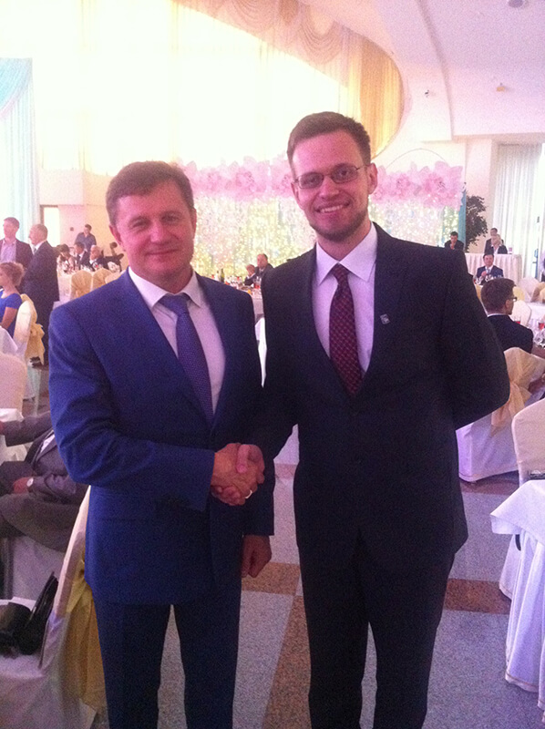

Но какой смысл тогда для этого целый пост в блоге писать?

Не так давно, а точнее в день получения диплома инженера-программиста в родном БГУИР, я задумался, скольким Великим, с моей точки зрения, людям за свою короткую пока жизнь я успел пожать руку. Оказывается, список не такой уж и скудный, скажу я вам. Итак, по порядку.
<!--more-->
* * *

## Ректор БГУИР **Михаил Павлович Батура**

> Белорусский специалист в области системного анализа, управления и обработки информации в технических и организационных системах, доктор технических наук, профессор, академик Международной академии наук высшей школы. Ректор Белорусского государственного университета информатики и радиоэлектроники с 2000 года.

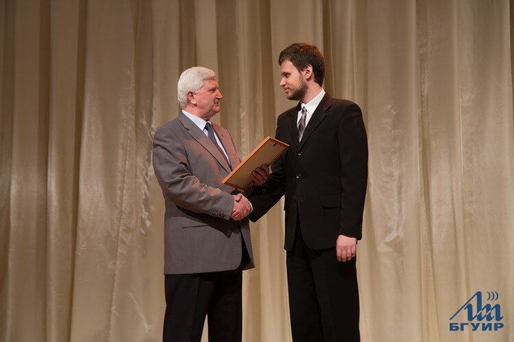

Да, этим может похвастаться немалое количество моих знакомых. Студсоветчики же ибо. Но, если начистоту, из более 8000 студентов (с заочниками и вечерниками) и более 800 (это число слышал от кого-то из ректората) сотрудников университета многие ли могут гордиться тем же? Возможно, кто-то не сочтет это достаточным поводом для гордости. Пусть Михаил Павлович уже в возрасте, местами авторитарен, но он все же привел наш университет к расцвету и узнаванию «бренда» БГУИР не только в нашей стране, но и далеко за её границами. Поэтому да, я горжусь тем, что мне Михаил Павлович не раз пожимал руку.

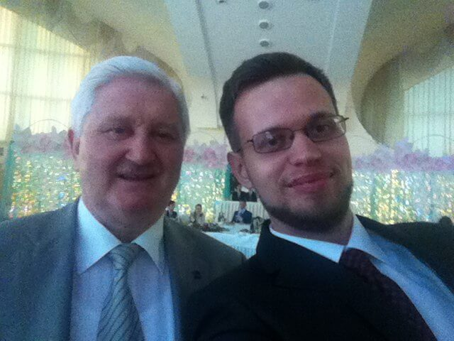

* * *

## Бывший Министр образования **Сергей Маскевич**

> Сергей Александрович Маскевич — белорусский государственный деятель, депутат Палаты представителей Национального собрания, Министр образования Республики Беларусь с 29 декабря 2010 года по 27 декабря 2014 года. Доктор физико-математических наук, профессор.

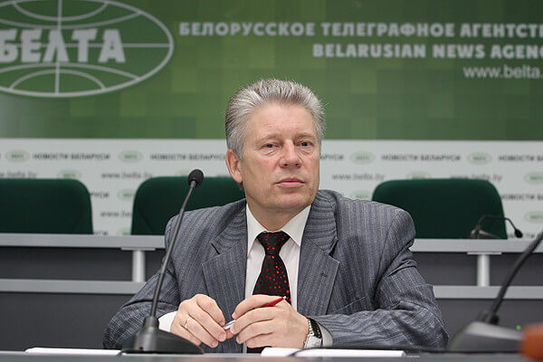

Тут вообще смешная ситуация получилась. Это был мой первый год работы в приемной комиссии университета. Работаю такой, принимаю заявления от абитуриентов. Вдруг все начальство заходит в актовый зал, к нам, студентам, подходят. Один из представителей делегации, самый маленький, но самый седой, мне руку пожал, поздоровался, что-то спросил дежурное, я что-то стандартное ответил, и вся делегация отправилась дальше общаться. А потом уже, минут через 10, мне объяснили, что это за мужчина такой к нам заходил. Первый раз **Министру** руку пожал, но не понял этого. Так-то вот.

Кстати, ровно через 3 года ситуация почти повторилась. Я тогда [сборы военные проходил](#), но учебную часть сборов вместо полевых занятий по договоренности с офицерским составом работал в приемной комиссии, снова. Понятное дело, в казарме костюм я не держал, на работу приезжал в удобном, а именно в шортах и тенниске. И вот представьте, сижу я у себя в «комнате обработки информации», заходит какой-то мужчина в костюме и с богатым галстуком, здоровается, руку мне пожимает, ему все что-то рассказывают... Мне в казармы возвращаться надо было, поэтому кто это был я не успел спросить. Сижу, значит, вечером перед телевизором, «Панараму» всей ротой смотрим, а там этот мужчина интервью дает. И не простой это мужчина, а первый заместитель министра образования — **Вадим Богуш**. Жаль, не видел я свое лицо со стороны. Но, говорят, челюсть моя была ниже уровня, положенного по Уставу.

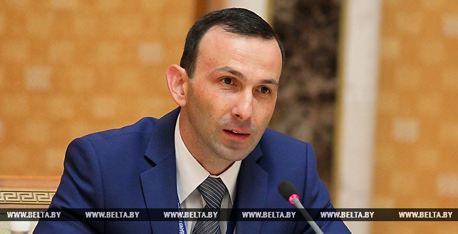

* * *

## Глава офиса «Яндекс» в Беларуси **Алексей Сикорский**

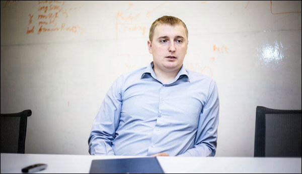

Это сейчас он глава офиса. А вот 10 лет назад был известным олимпиадником, сам школьные олимпиады по информатике помогал организовывать. И курировал Витебскую область. Ну, а ваш покорный слуга без дипломов с областных олимпиад по информатике ни разу не возвращался. Собственно, получая очередной диплом III степени (я же не говорил, что крутые дипломы получал), руку будущему главе _"Яндекс"_ в Беларуси и пожал.

* * *

## Бывший Министр народной культуры **Анатолий Бутевич**

> Старшыня Дзяржаўнага камітэта па друку (1990-1992), міністр інфармацыі (1992-1994), міністр культуры і друку Рэспублікі Беларусь (1994-1996). У 1996-1998 — Генеральны консул Рэспублікі Беларусь у Гданьску. У 1998-2000 Надзвычайны і Паўнамоцны Пасол Рэспублікі Беларусь у Румыніі. У 2001-2009 — саветнік старшыні Банка міжнароднага гандлю і інвестыцый. У студзені-маі 2009 — галоўны спецыяліст упраўлення мастацтваў Міністэрства культуры Рэспублікі Беларусь. Мае дыпламатычны ранг Надзвычайнага і Паўнамоцнага Пасла Рэспублікі Беларусь.

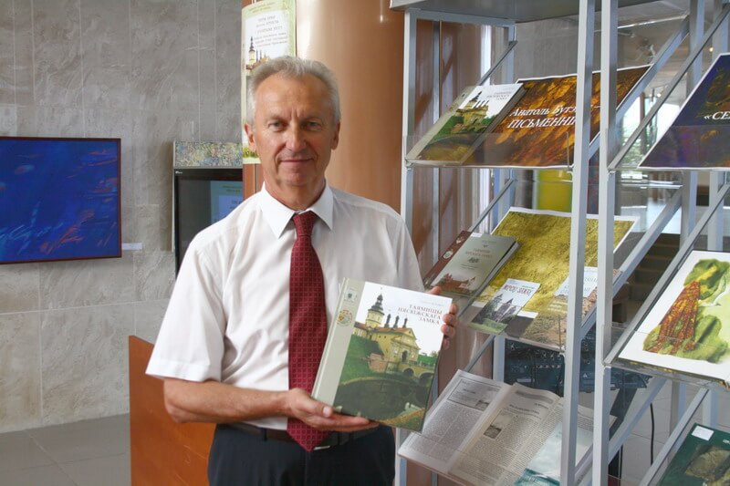

Тут все просто. Анатолий Иванович отмечал юбилей в Национальной библиотеке презентацией собственной книги _"Таямніцы Нясвіжскага замка. Падарожжа ўглыб стагоддзяў з Уладзіславам Сыракомлем"_. Меня по знакомству пригласила туда **Наталья Владимировна Башкирова**, которая после нашего студклуба университетского организаторской деятельностью в этой самой библиотеке занималась. Не просто пригласила, а песню спеть, Мулявинскую _"Молитву"_. Вот за эту песню юбиляр руку мне и [пожал](http://www.nlb.by/portal/page/portal/index/detailed_news?param0=80872&lang=ru&rubricId=424). Приятна такая оценка моего исполнения.

* * *

## Белорусская поп-певица **Искуи Абалян**

Ну, как пожал... Подержал. В 2013 году на **День Учителя** пригласили выступить для лучших учителей страны на государственном концерте. Пел, как обычно, _"Вечную любовь"_. Почему как обычно? А вы спросите у кого-нибудь из творческих университета нашего, с какой песней я у них ассоциируюсь, ага. Никогда не отвяжусь от этого ярлычка... Но не суть, тогда я тоже эту песню пел. А еще там пела **Искуи Абалян**. И вот, когда ей нужно было по ступенькам спуститься со сцены за кулисами, я решил проявить галантность и подать даме руку. И ведь не отказалась, несмотря на статус. Я еще тот концерт люблю вспоминать горделивой фразой _"Цветы дарили только мне и Искуи Абалян"_. Пафосно, но факт.

* * *

## Лауреат Нобелевской премии по физике **Жорес Иванович Алфёров**

> Жоре́с Ива́нович Алфёров — советский и российский физик, единственный ныне здравствующий — из проживающих в России — российский лауреат Нобелевской премии по физике (премия 2000 года за разработку полупроводниковых гетероструктур и создание быстрых опто- и микроэлектронных компонентов). Вице-президент РАН с 1991 года. Председатель Президиума Санкт-Петербургского научного центра РАН.

А вы что думали? Да, я пожимал руку нобелевскому лауреату. И безумно этим горжусь. Это сейчас я простой и скромный, как валенок. А в школьные годы мог себе позволить и не такое.

_/горделиво вскинув нос, снисходительно посмотрел на воображаемых читателей/_

Если серьезно, то мне несказанно повезло родиться и вырасти в нужном городе. Родители **Жореса Ивановича** — чашничане, как и я. Поэтому сам **Алферов** — почетный и частый гость в нашем городе. А как-то в нашем районном отделе образования появилась бумага, что нужно среди чашникских школьников найти лучшего, чтобы на стипендию [Международного Алферовского фонда](http://www.bsuir.by/online/showpage.jsp?PageID=90447&resID=100229&lang=ru&menuItemID=117893) подать. Именно из Чашник, просто потому что. И то ли в Чашниках совсем туго с умненькими школьниками было, то ли я и правда в этой жизни что-то могу, но выбрали меня. А был тогда год юбилейный у Жореса Ивановича, поэтому всех стипендиатов бесплатно в Санкт-Петербург на праздничные мероприятия [отвезли](http://nspaper.by/2010/03/23/stipendiya-ot-zhoresa-alferova.html). Собственно, лично из рук юбиляра сертификат на стипендию и получил. И гордиться этим буду, определенно, всю жизнь. Кстати, о той поездке, наверное, надо будет отдельный пост в блоге опубликовать как-нибудь.

* * *

## Ген. директор завода «Аливария» **Денис Шерстенников**

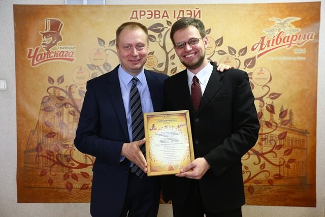

Не, ну а что? Вот вы руку директору главного пивзавода страны пожимали? То-то же. А я вот стипендию имени Чапского [отхватил](http://www.sb.by/obshchestvo/article/oni-okunulis-v-reku-vremeni.html) на последнем курсе, а Чапский был кто? Правильно, основатель завода и минский градоначальник по совместительству. Мужик, кстати, этот **Денис Шерстенников**, прикольный. На церемонии награждения этой стипендией было столько всяких официальных и пресных представителей управления. А он простой сидел и улыбался много. Не мне одному понравился, кстати.

* * *

## Главный редактор TUT.by **Марина Золотова**

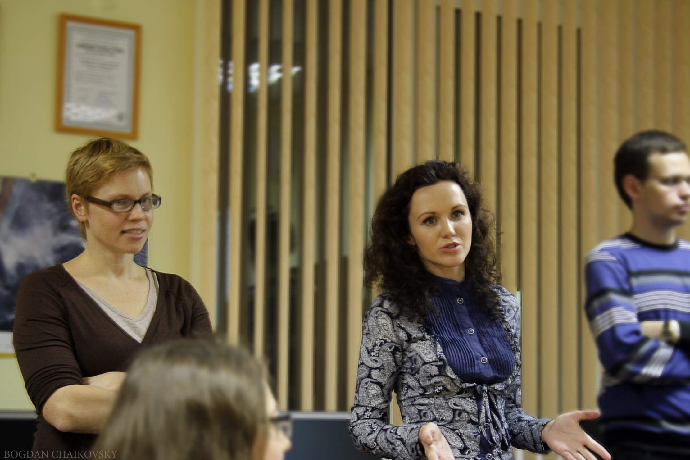

Что называется, наглость — второе счастье. В 2012 году на факультете взялся за реализацию идеи самого опытного и ленивого ветерана пресс-центра ФКСиС [Максима Рогова](http://mr-ten.tumblr.com). Идея состояла в проведении [мини-курсов от журналистов-любителей](http://fksis.bsuir.by/other-info/news/2013-12-07%20news%20journalists%20school) для студентов нашего университета. Надо было как-то людей в пресс-центр набирать. И чтобы проект не оказался совсем уж тухлым, написал одной бойкой журналистке из _tut.by_, которая летом в приемной комиссии у наших студентов интервью брала. Сама она поучаствовать не смогла ввиду пребывания за границей в командировке, но зато дала контакты **Екатерины Синявской** — автора очень даже громких статей на все том же _тут.бае_. И Екатерина не просто согласилась провести занятие, но еще и главного редактора с собой привела. Учитывая график работы этих женщин, мне очень повезло, что у них нашлось окно для проведения мини-лекции для БГУИРовцев. Больше не буду бояться обращаться за помощью к известным людям. А вдруг помогут?

* * *

## Ведущий телеканала ОНТ **Олег Лепешенков**

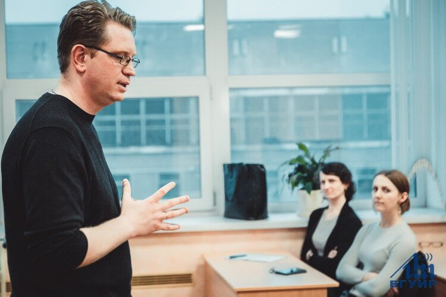

Тут спасибо надо сказать **Алене Александровне Соколовской**, которая взялась продолжать проект _"Школа Журналистов"_ годом позже. И не просто продолжила, а прям с ходу дала ему такое [ускорение](http://www.bsuir.by/online/tnj2/one_article.jsp?resID=100229&rid=102243&tnj_id=11961&lang=ru), что интерес к нему резко возрос, ибо лекторами были люди, в журналистских кругах очень даже известные. Одним из них и был **Олег Лепешенков**. Вот вы его каждую неделю по телевизору видите в программе _"Наши новости"_, а я ему руку пожимал и даже беседовал на интересные темы. Очень умный человек, между прочим, а еще он очень много благотворительностью занимается. Есть, за что уважать помимо журналистики.

* * *

## Первый зам. главы администрации Президента **Александр Радьков**

> Александр Михайлович Радьков — министр образования Республики Беларусь в 2003–2010 годах, в настоящее время (2011) первый заместитель главы администрации президента Беларуси.

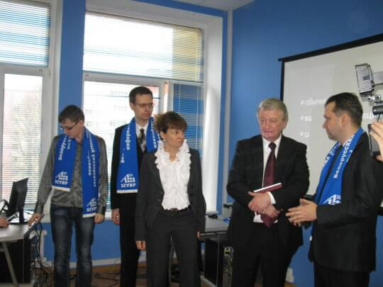

Проект _"Школа Журналистов"_ давно известен не только внутри нашего университета. Креативно-инновационный центр при Мингорисполкоме пригласил в феврале 2014 года провести занятие по ведению блога в Интернете (занятие, по блогам, настоящее, с презентацией, не в шутку) во время какой-то там республиканской конференции. Одним из гостей мероприятия был **Александр Михайлович**, который пожал мне руку, заглянув на минуту на это самое занятие.

* * *

## Министр Образования Республики Беларусь **Михаил Анатольевич Журавков**

> Михаил Анатольевич Журавков — белорусский математик, доктор физико-математических наук. Профессор Белорусского государственного университета, первый проректор БГУ с 2009 года, министр образования Республики Беларусь с декабря 2014 года.

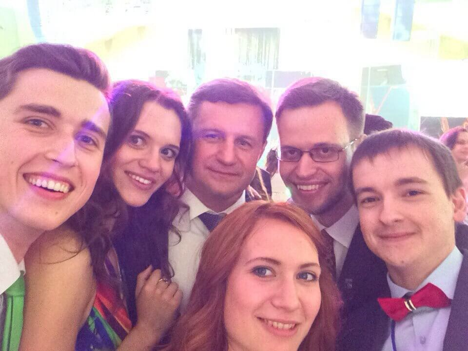

Собственно, из-за чего этот пост и увидел свет. Да, руку бывшему Министру образования я пожимал уже задолго до этого, но ведь было это неосознанно, да и список [100 вещей, которые следует сделать в жизни](http://dark-mefody.tumblr.com/100vkssvzh), еще не был даже в проекте. Осознанно же получилось это сделать лишь в этом году на [Президентском балу](#). И, кстати, как вам скажет любой студент-активист, у которого была возможность пообщаться вживую с **Михаилом Анатольевичем**, сфотографироваться с ним совсем не сложно — он очень добрый и не отказывает в такой маленькой просьбе. Даже на селфи с ним реагирует очень позитивно, в отличие от нашего декана ФКСиС **Валерия Александровича Прыткова**. Ему, кстати, я тоже руку пожал, вот только на вручении дипломов это многие сделали, поэтому не редкость. Только не подумайте, что я декана не уважаю. Уважаю, и даже очень. Но селфи с ним у меня нет, увы.

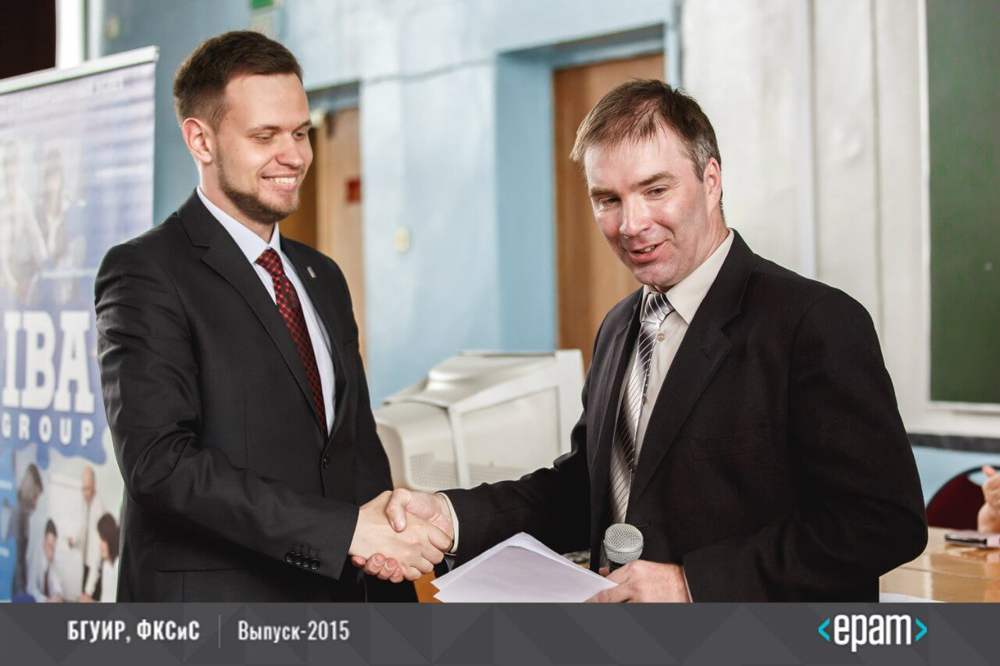

* * *

## Выпускник ФКСиС **Алексей Ропан**

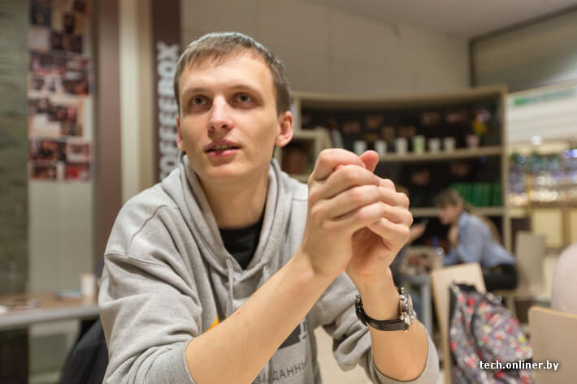

_"Кто такой?"_ — спросите вы. _"Пфффф"_, — отвечу я вам. Леша, между прочим, в топ-20 лучших программистов мира по версии _Top Coder_ [входит](http://tech.onliner.by/2013/12/13/finalist). А еще в составе команды БГУИР завоевал [бронзовую медаль](http://fksis.bsuir.by/other-info/news/2012-05-17-icpc-final-results) на Чемпионате мира по спортивному программированию. А со мной здоровается или _"О, привет"_, или _"Как дела?"_ На самом деле, до одури простой человек с непростым характером. Причем сразу он мне как-то со стороны не понравился, а после знакомства — вообще отличный парень. Может, сейчас о нем мало кто слышал, кто в олимпиадных кругах не крутится, но, поверьте мне, о нем еще услышат далеко за пределами БГУИР.

* * *

Вот еще небольшой список известных в некоторых кругах людей, кому я пожал руку:

* сооснователь проекта [Maps.Me](http://fksis.bsuir.by/other-info/news/2012-11-04+news+alex+zolotarev) **Александр Золотарев**;

* сооснователь стартапа [Meshtrip](https://www.linkedin.com/in/makarenkoadam) **Адам Макаренко**;

* владелец [выставки ретро-компьютеров](http://tech.onliner.by/2014/03/27/alexander-alexandrov) **Александр Александров**;

* самый молодой профессор в БГУИР, доктор технических наук **Александр Иванюк**;

* зам. председателя Общественного республиканского студенческого совета при Министре образования **Ирина Дорош** (и не только руку пожал);

* интеллектуал и бард-песенник со своим стилем **Сергей Башлыкевич**;

* заместитель Министра образования **Виктор Якжик**;

* главный инженер компании _Itransition_ и известный балагур **Павел Лебедев**;

* глава БРСМ города Минска **Юрий Чечукевич** и др.

* * *

Пока писал этот пост, понял две вещи:

1. У меня четко сформировалась цель пожать руку еще одному человеку. Если мечтать, то смело.

2. Не так уж и скучно я живу.

Многие умные книжки советуют общаться с теми людьми, которые могут на вас положительно повлиять. Мне в жизни повезло встретить множество таких людей и даже выполнить один из пунктов [100вкссвж](http://dark-mefody.tumblr.com/100vkssvzh). Попробуйте и вы так же ;)
