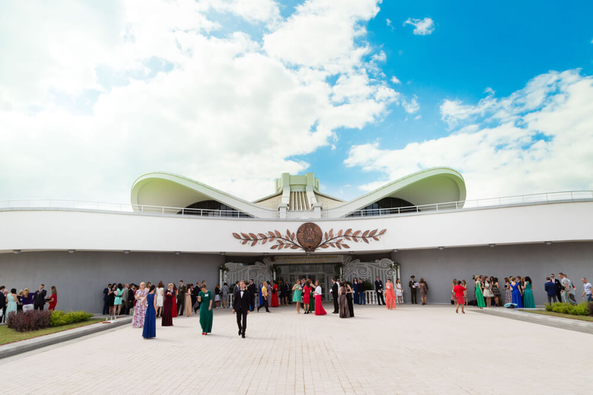
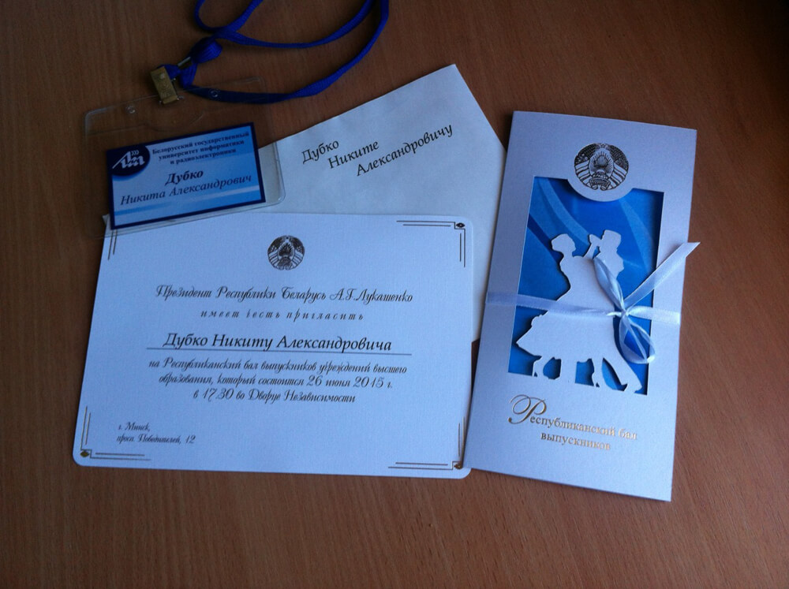
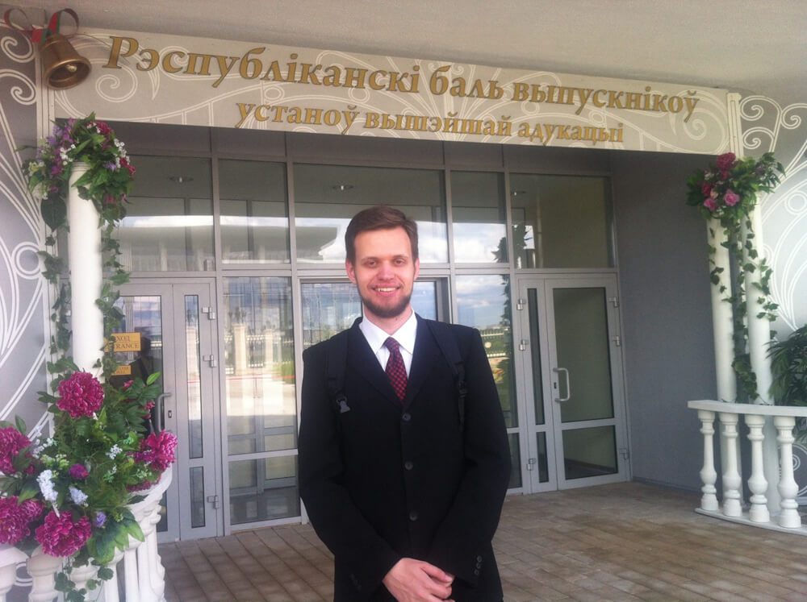
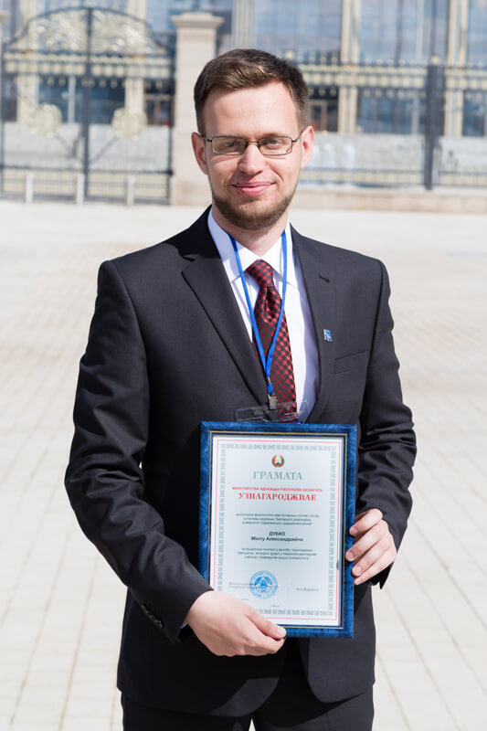
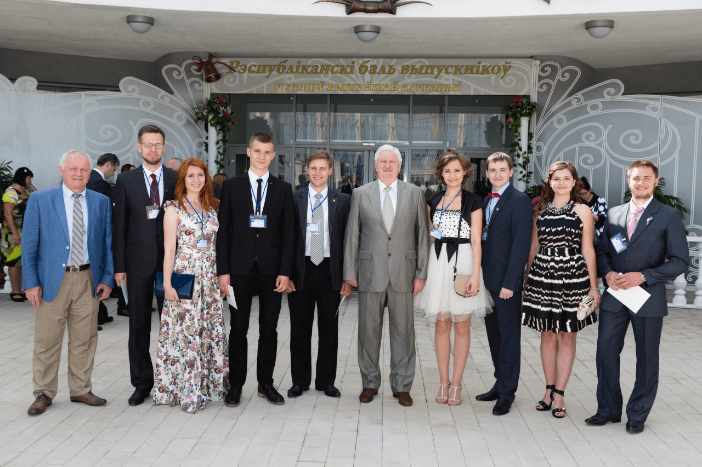
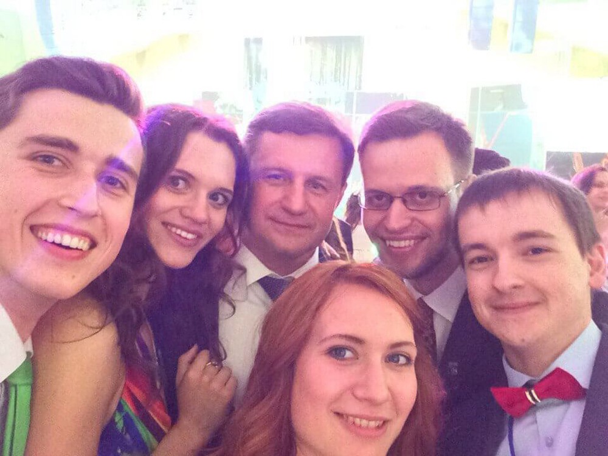

Как много вы знаете людей, которые свой выпускной отмечали в одном помещении с Президентом страны? До своего выпускного я знал четверых выпускников БГУИР, которым выпала честь попасть на **Республиканский бал выпускников с участием Президента Республики Беларусь**. И где-то два года назад задался целью стать одним из счастливчиков, которым такая возможность дается.

<!--more-->

Республиканский бал выпускников — мероприятие, на которое приглашаются лучшие из лучших всех вузов страны. Ежегодно проводится в даты вручения дипломов в университетах. Побывать на таком мероприятии можно только раз в жизни, если, конечно, не задаться целью попасть в рабочую группу этого действа (или стать ректором университета).

Не знаю, каким образом, но среди этих лучших как-то оказался и я. Университет отобрал _11 выпускников_, которых посчитал достойными чести представлять БГУИР на этом важном мероприятии. А мне даже посчастливилось поучаствовать в одном из номеров культурной программы вечера. Но, обо всем по порядку.

Сообщили мне о том, что я попал в число делегации от БГУИР, сразу после защиты диплома. Довольно приятное дополнение к максимальной оценке за дипломный проект. И тут же поставили перед фактом, что через два часа после звонка я должен явиться на репетицию бала в БелЭкспо, что возле Дворца Независимости. Нет, выбор мне, конечно, дали, мог и отказаться от участия в танцевальной части бала, но когда еще такая возможность выпадет?

Таких вот танцующих на балу нас оказалось 16 человек, то есть 8 пар. От БГУИР отправили меня и Катю Самутичеву, студентку (а ныне выпускницу) ФТК, с которой уже был знаком еще с первого курса. Наша задача была в участии во «флешмобе», когда некоторые выпускники «неожиданно» выходят из общей массы прямо во время культурной программы и начинают синхронно танцевать. Разумеется, для такого мероприятия флешмоб в классическом его понимании не подходит, поэтому репетиций «неожиданного» выхода было много.

_Фото сделано за два дня до бала_

Всего хореограф Женя ставил с нами три вида танца: полонез, джаз и хип-хоп. Понятно, что для тех, кто раньше никогда не танцевал и кому предстоит танцевать в вечерних платьях и деловых костюмах, простых движений каждого стиля достаточно. Главное — синхронность и четкость. Поэтому танцевать нас не научили, но зато простые движения мы отточили за неделю почти ежедневных репетиций до мелочей. Самое главное, чего не хватает на многих студвеснах — синхронность у нас получилась. И, судя по отзывам, смотрелось все на уровне, пусть и коротко. Да, кстати, хореограф наш оказался не так прост, как казалось: я его потом еще видел 4 раза в подтанцовках у наших звезд на Дне Независимости (Инна Афанасьева, Uzari и др.), так-то вот.

И вот настал день «икс», 26 июня. Для меня он начался чередой звонков о том, когда и где состоится вручение грамот Министерства образования. Все менялось каждые полчаса. Наконец, в 14:30 я прибыл в Министерство с четкой целью пожать руку Министру образования (100 вкссвж как-никак). Увы, Михаил Анатольевич не смог присутствовать на церемонии награждения, поэтому грамоту мне вручил и пожал руку Виктор Викторович Якжик, зам. министра. Но общее фото с Министром все же получилось, успел. Затем вся процессия награжденных отправилась на отечественном автобусе сквозь пробки к празднику.

Возле БелЭкспо каждого уже ждала своя делегация. БГУИР отыскать было несложно, Максим Юрьевич Максак возвышался над толпой выпускников, фотографируя БГУИР на память и для пресс-службы. Многие уже устали ждать начала, но такие уж издержки мероприятий такого уровня — нужно уметь терпеть.

Наконец прибыли все вузы, и наша делегация стройными рядами в общей колонне отправилась во Дворец Независимости под взглядами телекамер. И впечатления от этого, скажу я вам, незабываемые. Ты идешь по красной дорожке в дорогом (сравнительно) костюме, тебя снимает телевидение, а перед тобой открыты двери Дворца, в котором до этого бывали только Великие мира сего. И мы были первыми простыми смертными, кого туда пустили.

А затем была речь Президента страны. Казалось бы, такой волнительный момент — вживую видеть Александра Григорьевича, довольно близко и четко. Но нет, отчего-то я был спокоен, как слон. Даже незнание Гаудеамуса не смутило, когда его нужно было петь в общем нестройном хоре из 253 выпускников.

<iframe width="800" height="450" src="https://www.youtube.com/embed/NviWXi_jBcA?feature=oembed" frameborder="0" allowfullscreen></iframe>

Завершилась торжественная часть, и колонна во главе с Президентом направилась на Бал. Убранство главного зала БелЭкспо после репетиций изменилось до неузнаваемости. Столы, которые изначально планировались под фуршет, были расставлены по-другому, каждым 9 человекам по своему столу с официантами и обилием блюд. Да, в такие моменты понимаешь, как приятно жить красиво.

Мне выпало сидеть за одним столом с ректором и Министром образования. Михаил Анатольевич, скажу я вам, потрясающий человек. Он абсолютно простой и открытый в общении, при этом не дает вести с ним себя непочтительно. И глаза — очень добрые и уставшие. А сколько селфи и просто фото с ним за вечер сделали выпускники? Сколько девушек приглашали его на «белый» танец? И никому не отказывал. Что еще забавно, заводилой за столом в плане поднятия тостов тоже был Министр. Вот такие впечатления у меня от этого восхитительного человека.

Танец свой «неожиданный» мы оттанцевали четко и быстро. Некоторые даже переживали, что потратили неделю репетиций ради 2 минут дрыганья конечностями. А я не жалею. Все остальные сидели и смотрели, а мы были на сцене и что-то для своего Бала сделали. Ведь никто из них полонез на балу не танцевал.

А потом были песни. Много песен, много артистов: Герман Титов, Алена Ланская, Ольга Плотникова, Алексей Хлестов, Жанет, Тео, Дядя Ваня, Саша Немо, Da Vinci и другие «известные» лица белорусской эстрады. Приятно, что в большинстве своем пели вживую, не под плюсовку. Чистотой голоса огорчили только Da Vinci — увы, кроме итальянского текста их песни ничем больше интересны не были, ибо в ноты Денис Дудинский попадал не лучшим образом.

<iframe width="800" height="450" src="https://www.youtube.com/embed/aLw1AeyQPXY?feature=oembed" frameborder="0" allowfullscreen></iframe>

Вечер был длинным, но прошел уж очень быстро. Вкусная еда, красивые платья и костюмы, звезды на сцене, высокие чины за столом рядом — все это прошло. Впереди — обычные будни, ностальгические настроения при виде фотографий с Бала и легкая гордость от того, что руку Министру образования я все-таки пожал. А [список вещей, которые следует сделать в жизни](http://dark-mefody.tumblr.com/100vkssvzh), тем временем пополнился еще одним выполненным пунктом.
