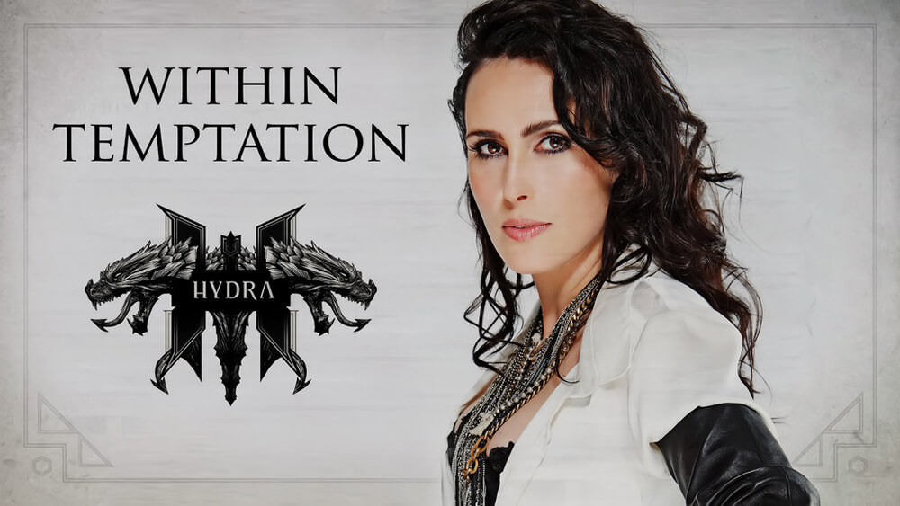
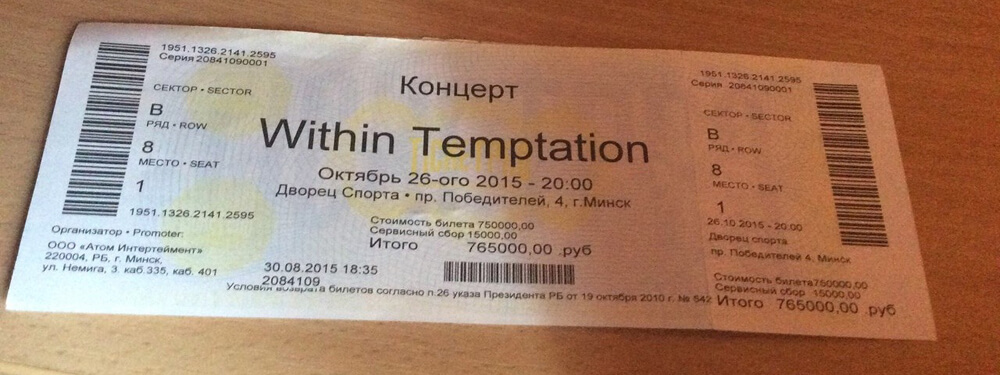
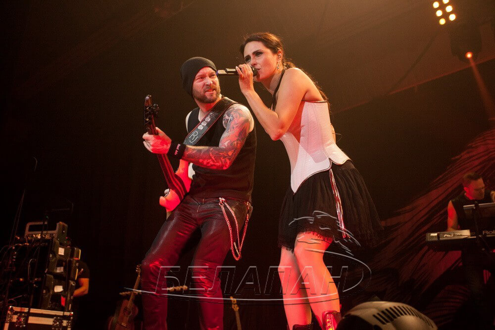
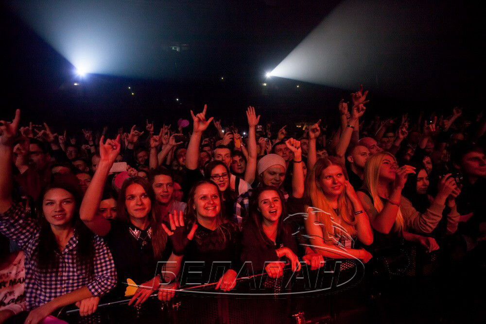
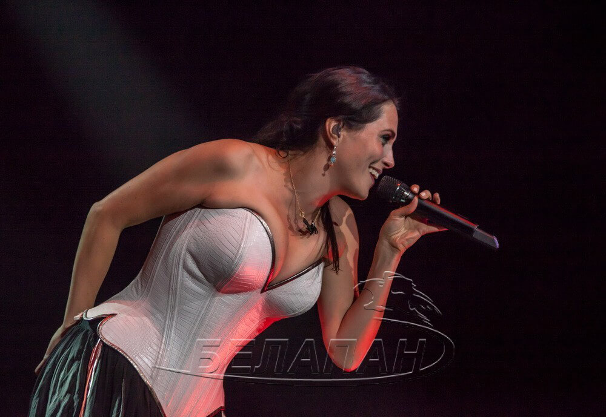

До этого года я как-то не сильно увлекался посещением живых концертов. Можно ведь скачать всю дискографию любимой группы, найти хорошие наушники и наслаждаться музыкой в комфорте и без лишнего шума. [Концерт Linkin Park](#) стал переломным моментом — теперь я понимаю, зачем люди ходят на такие мероприятия.

**26 октября** во Дворце Спорта прошел концерт обожаемой мной еще с 6 класса школы симфо-готик-метал группы **Within Temptation**. И пропустить его я просто не мог.
<!--more-->
**Within Temptation** уже приезжали в Беларусь в марте 2014 года. Тогда я слишком поздно узнал об их концерте, поэтому грустненький слушал восторженные отзывы одногруппников и надеялся, что когда-нибудь они еще к нам приедут. И вот, свершилось!

В рамках мирового тура в поддержку нового альбома **Hydra** группа посетила города России, Украины, а завершающим штрихом стал концерт в Минске. Об этом событии я узнал заранее, поэтому билеты купил сразу же, как они появились в продаже. Нет, не фанзона, увы. Но места по центру, головой ворочать не пришлось.

Забавно было перед самым входом во Дворец спорта наблюдать огромную очередь ближе к метро и две маленькие очереди у самых дверей. Эффект толпы — наше все. Да, сам я тоже сначала стоял в первой большой очереди, но потом все же перебежал в маленькую уютную поближе.

Людей, конечно, было меньше, чем на _Linkin Park_. Но оно и понятно. **WT** — не попсовая группа, да и по радио их песни не крутят — очень уж тексты не православные. Но фанзона была забита полностью, на фото видно.

Программа концерта, как и ожидалось, не была целиком из композиций нового альбома **Hydra**. Пара песен была оттуда, но в основном **Шарон ден Адель** радовала поклонников хорошо известными хитами, от _Mother Earth_ и _Stand My Ground_ до _Faster_ и _Fire and Ice_.

Самое большое впечатление оставила сама **Шарон**. Ей 41 год, у нее двое детей, своя компания — и вы посмотрите, как человек отрывается на сцене. Да у нас так прыгать может только Александр Солодуха, остальные исполнители сломаются ведь. А вот **Шарон ден Адель** — не сломалась. В общем, шикарная женщина.

<iframe class="youtube-media" id="youtube_iframe" allowfullscreen src="https://www.youtube.com/embed/FTzhxXOyWBw?feature=oembed&amp;enablejsapi=1&amp;origin=https://safe.txmblr.com&amp;wmode=opaque" frameborder="0"></iframe>

Порадовал фанклуб группы. Ребята малыми силами организовали кучу флешмобов: огромное количество сердечек из бумаги в фанзоне, живой логотип **The Unforgiving** в секторах с инструкцией к его составлению для непосвящённых, милые праздничные колпаки для поздравления бас-гитариста **Йеруна ван Вена** с днем рождения, фонарики на песне _Fire and Ice_... В общем, и на этот раз Минск запомнился группе преданностью и придумками клуба фанатов.

<blockquote class="instagram-media" data-instgrm-captioned data-instgrm-version="7" style=" background:#FFF; border:0; border-radius:3px; box-shadow:0 0 1px 0 rgba(0,0,0,0.5),0 1px 10px 0 rgba(0,0,0,0.15); margin: 1px auto; padding:0; width:99.375%; width:-webkit-calc(100% - 2px); width:calc(100% - 2px);">
 
 

 
 <a href="https://www.instagram.com/p/9UQ3m-TE2y/" style=" color:#000; font-family:Arial,sans-serif; font-size:14px; font-style:normal; font-weight:normal; line-height:17px; text-decoration:none; word-wrap:break-word;" target="_blank">Thank you for your energy, the flashmobs... , jeroen&#39;s birthday bash!!! Perfect last evening #minsk #belarus 👍👍🎈</a>
 
Публикация от Within Temptation (@wtofficial) <time style=" font-family:Arial,sans-serif; font-size:14px; line-height:17px;" datetime="2015-10-26T21:54:17+00:00">Окт 26 2015 в 2:54 PDT</time>

</blockquote>

* * *

Это событие стоило того, чтобы его посетить. Впечатлений — море, эмоций — еще больше. Я наконец-то увидел и послушал вживую тех, от кого фанател когда-то несколько лет. И пускай этот пункт из [100вкссвж](http://dark-mefody.tumblr.com/100vkssvzh) уже был выполнен ранее, никто же не мешает выполнять эти самые пункты по несколько раз!
