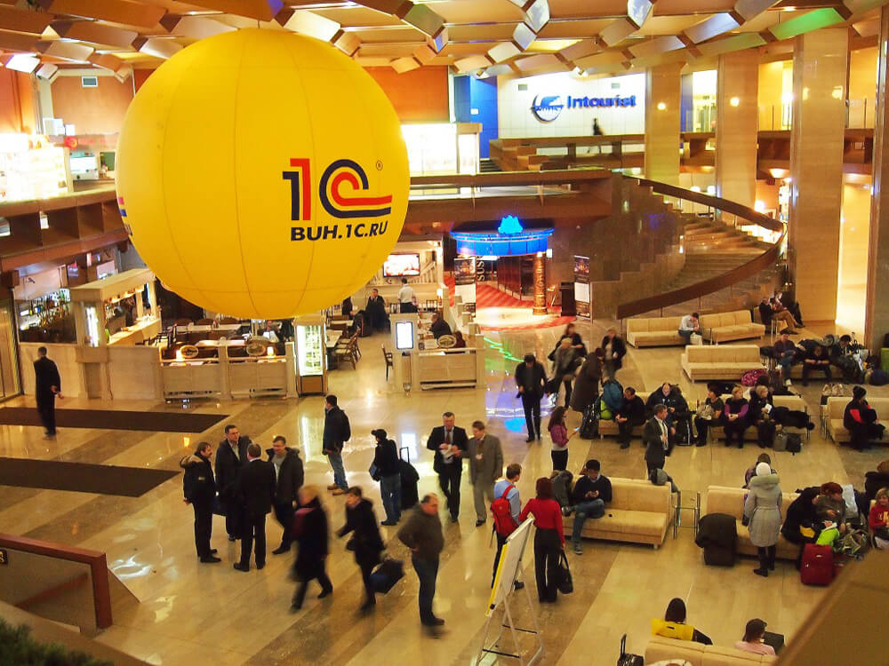
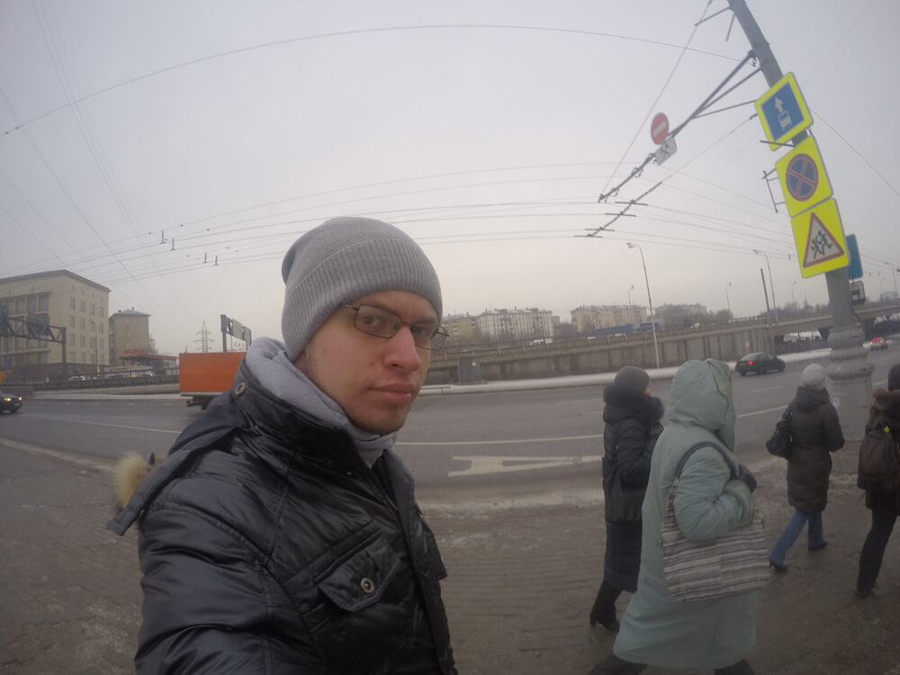
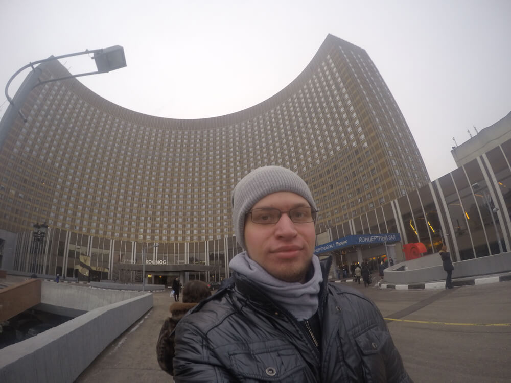
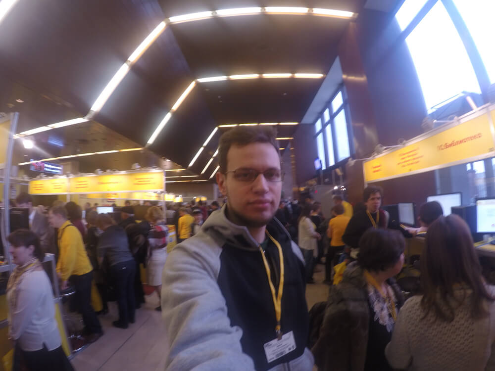
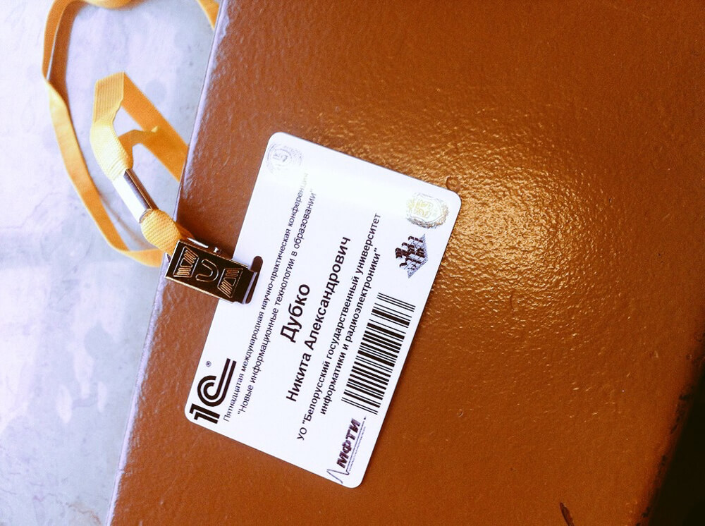
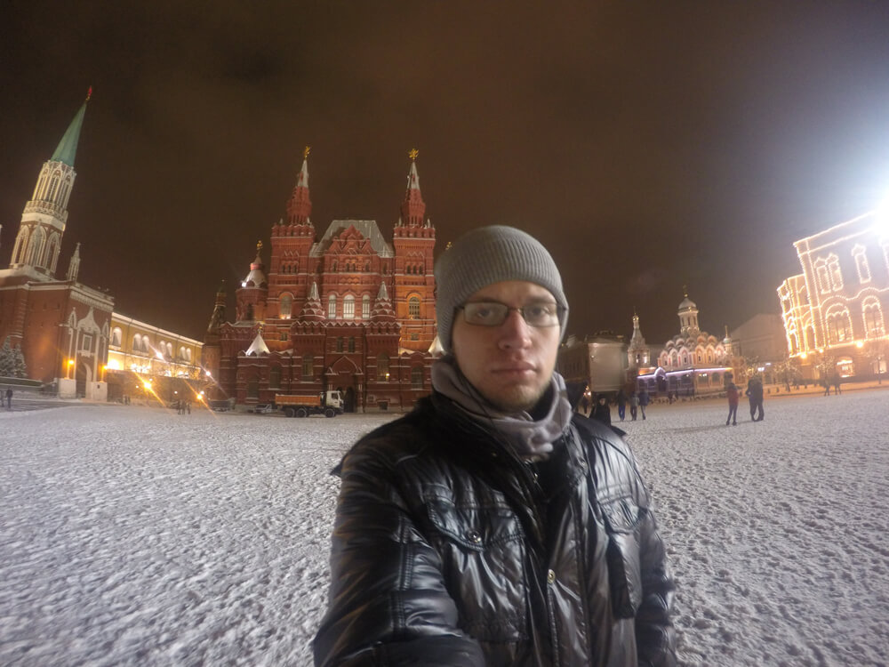
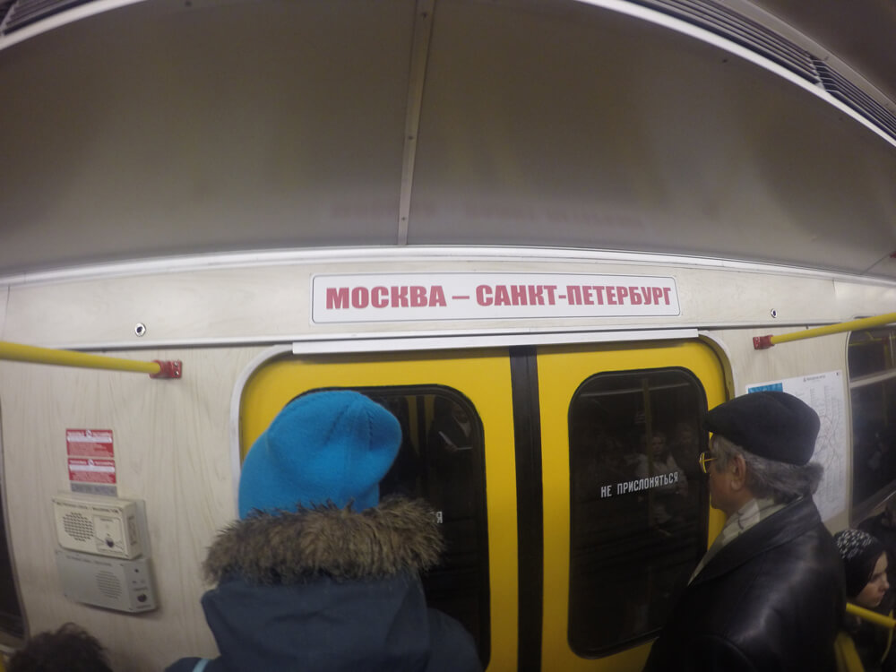
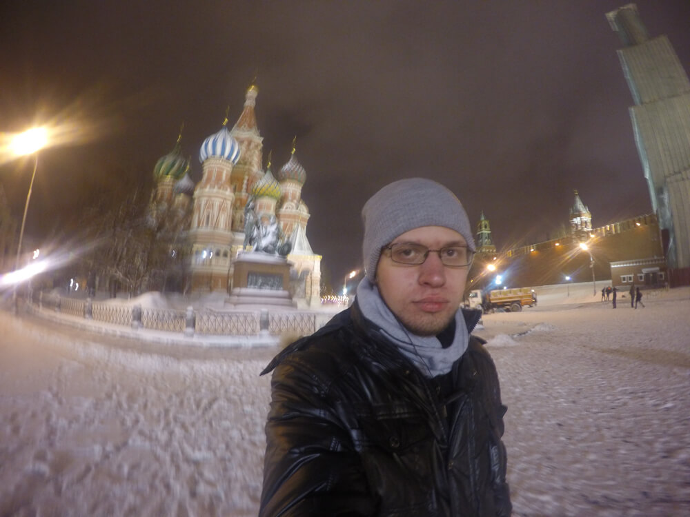
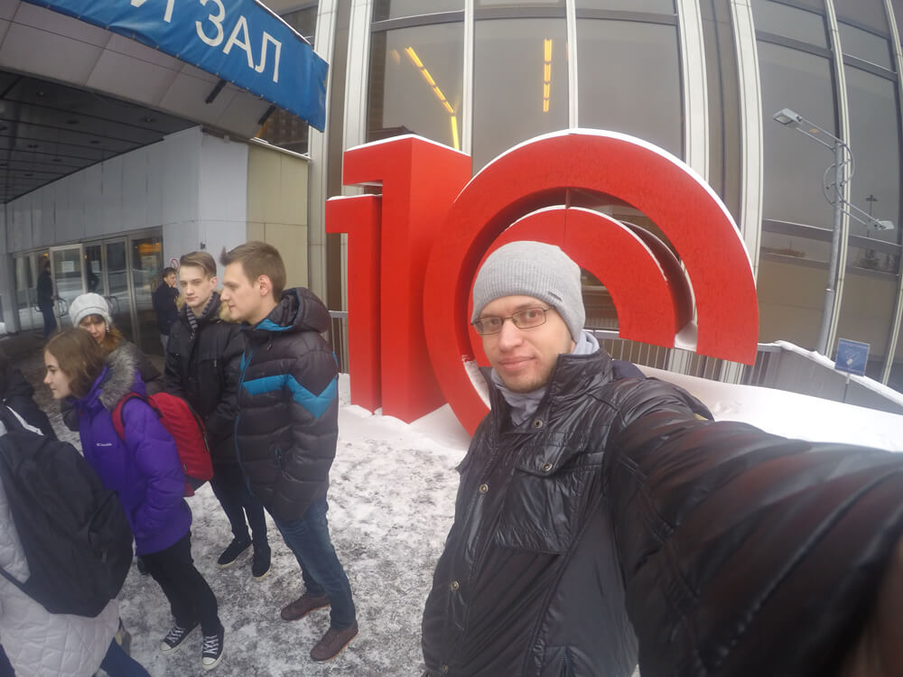

**С 3 по 4 февраля** мне удалось побывать **в Москве**. Любимая кафедра в качестве подарка будущему сотруднику (и нынешнему проходящему практику) дала мне возможность посетить _15 международную научно-практическую конференцию «Новые информационные технологии в образовании»_ (Применение технологий «1С» для формирования инновационной среды образования и бизнеса). Да, вот такое длинное название, а суть простая: рекламное мероприятие от фирмы «1С» аж на 2.5 тысячи человек.

А теперь обо всем поподробнее.
<!--more-->

---

## День 0\. Предварительный

О конференции мне сообщили неожиданно и всего за 3 дня до поездки. Позвонила Наталья Владимировна Лапицкая, заведующая нашей кафедрой, и предложила посетить мероприятие с длинным названием (см. выше) на льготных условиях. Москву я раньше не видел, потому согласился довольно быстро.

Стоит отметить, что руководство университета отказалось каким-либо образом финансировать эту поездку, посчитав конференцию по 1С недостаточно важным мероприятием, чтобы на него тратить деньги. Компания **«МиСофт»** же совершенно неожиданно и безвозмездно очень щедро проспонсировала расходы в России. Не попрекаю университет, просто делюсь фактом.

Всего в нашем микроавтобусе ехали 2 преподавателя нашей кафедры, 2 преподавателя МГЭУ, 8 студентов третьего курса ПОИТ и 1 студент пятого курса (то есть я). Довольно разномастная компания.

Маршрут наш лежал через Оршу, где слегка угрюмый водитель, который вез нас от Минска, уступил «баранку» задорному и юморному Дмитрию. Очень позитивный человек, местами даже чересчур. Но и водитель хороший тоже — довез до Москвы за 8 часов без происшествий и непредвиденностей. Один недостаток: ноги у меня длинные, поэтому колени в маршрутках обычно страдают. Так и в этот раз: вроде, поспал, но проснулся физически убитым телом.

Приехали в Москву мы раньше запланированного времени, часов на 7 раньше. Дело в том, что у нас был забронирован хостел на 9:00 утра, а более раннее заселение — оплата дополнительного дня проживания. Но не ждать ведь на улице, если места для заселения есть. Проплатили, чего уж там. Да, ночевали мы в [tipa-hostel](http://tipo-hostel.ru): бюджетно, комфортно, бесплатный Wi-Fi (хотя сейчас этим никого уже не удивишь), приветливый персонал, рядом с метро, рекомендую.

---

## День 1\. Познавательный

С этими отменами переходов на летнее и зимнее время чуть не случился казус. Мой телефон искренне посчитал, что время в Минске и Москве отличается на час, поэтому будильник прозвенел на час раньше. Не самая большая беда, чем заняться до общего подъема нашел все равно.

Теперь непосредственно о конференции. Масштаб ее поистине впечатляет: 2.5 тысячи участников, огромное количество сувениров и раздаточного материала, около сотни различных докладов и мастер-классов. Уже не первый год для такого крупного мероприятия фирма «1С» использует **отель «Космос»** (бывшая гостиница «Космос») на ВДНХ. Очень красивое здание, как снаружи, так и внутри.

Так уж получилось, что недавно я начал перечитывать серию «Дозоры» Сергея Лукьяненко. И знающие люди смогут по ходу моего рассказа замечать, что я посетил немало мест именно из этой серии книг. Даже приложение [Swarm](https://www.swarmapp.com) предлагает зачекиниться в офисе Дневного дозора, если находиться в отеле «Космос».

> Вот и Проспект Мира; лесенка, поворот направо, эскалатор, и поезд как раз подходит. «Рижская». «Алексеевская». «ВДНХ». Из вагона — направо, это я всегда знал.
> Длинный-длинный эскалатор, на котором почему-то ни о чем не думается. Опять назойливая реклама. Подземный переход. И гостиница. Подковообразный монстр французской архитектуры. Впрочем, гостиница изменилась, и заметно. Добавилось подсвеченных вывесок, ярких огней; опять же — казино, призовая иномарка на постаменте.
> <cite>Сергей Лукьяненко, «Дневной дозор»</cite>

Сама конференция проходила очень динамично. Стоит отдать должное организаторам, логистика мероприятия была продумана качественно. Зона, в которой располагались палатки с литературой, регистрация, оргкомитет, чем-то напоминала цыплятник. Все потому, что желтого было уж слишком много: майки организаторов, пакеты с сувенирной продукцией, сами стенды и плакаты. Но негатива пресыщение этим цветом не вызывало, даже мило было наблюдать это цветовое единство.

Докладов с утра было немного. Состоялось официальное открытие, приветственные слова ректора МФУ, министра связи и массовых коммуникаций РФ и большой доклад директора компании «1С» **Бориса Георгиевича Нуралиева**.

Потом началось самое интересное: _обед_. Конференция была организована для преподавателей, казалось бы, людей с высокими моральными ценностями. Увы, первая ступень пирамиды Маслоу превалировала над другими. Огромные очереди в два зала-ресторана (_"Галактика"_ и _"Калинка"_), буйное недовольство организацией бесплатного обеда от далеко не худых людей, выкрики _"а вас здесь не стояло!"_ в адрес организаторов. Не знаю, почему, но мне моментами было стыдно за такое поведение взрослых и уважаемых в своих кругах людей. Но, стоит заметить, вкусного и обильного обеда хватило всем.

Довольные и сытые участники конференции после обеда разбрелись по своим секциям. Кто куда отправился, отслеживалось организаторами по пропускам со штрихкодом на входах в конференц-залы.

Мы с Еленой Евгеньевной Фадеевой выбрали мастер-класс по проведению курсов по программированию на Java для школьников. Хороший, содержательный, аж на 4 часа мастер-класс. Возможно, какие-нибудь идеи из этого занятия возьму на вооружение в преподавательскую деятельность. Кто желает, может изучить структуру курсов на сайте [zprog.ru](http://zprog.ru).

Вместе с подарочными пакетами всем участникам выдали анкетки, которые желательно было заполнить для улучшения качества конференции. Мотивацией к заполнению лично для меня стали сувенирчики, которые выдавались в обмен на анкету. Так, за большую анкету с моими личными данными я получил лицензионную версию программы _"1C: Предприятие. Версия для обучения программированию"_. Она, конечно, урезанная, но ведь лицензионная. За анкетки-отзывы раздавали набор маркеров, забавного игрушечного барашка и календарь настольный. Мелочи, а приятно.

Изначально меня предупредили, что времени на погулять по Москве скорее всего не будет. Поэтому сразу после ужина и сброса запаса раздаточного материала в хостеле отправился на вечернюю прогулку по Москве. Ведь, если был в Москве, но не видел Красную площадь, значит не был в Москве. Собственно, туда и отправился.

Очень впечатлило **московское метро**: большое количество веток, огромные расстояния между станциями, умопомрачительная длина эскалаторов. Наверное, можно просто гулять по метро целый день, а то и два. Воистину, чудо архитектуры. Теперь наши минские короткие станции и миниатюрные эскалаторы не впечатляют совсем. Одно но: у нас гораздо чище и запаха какого-то неприятного нет. А еще в Москве некоторые поезда интересно оформлены. Так, за два дня мне удалось покататься на классическом метро, как в Минске; на маршруте _"Москва — Санкт-Петербург"_; на оформленном в довоенном стиле метро; в современных закупленных где-то за рубежом вагонах. Да, еще в метро уж очень много нерусских. Я не расист, не подумайте, просто их действительно очень много.

Итак, увидел **Красную площадь**, но был как-то огорчен. На всех фотографиях, на всех видео, что я видел, Красная площадь вся такая большая, чистая, величественная. А в жизни все оказалось куда прозаичнее. Нет, красиво и монументально, не спорю. Но маленькая она какая-то и не такая уж впечатляющая. Хотя, дыхание истории в этом великом для России месте ощущается.

> Булыжник Красной площади, помнивший и неспешный шаг царей, и сапоги революционных солдат, и гусеницы советских бронетанковых монстров, и ряды первомайских колонн, казался воплощением московской незыблемости. Этот город стоял и будет стоять, и ничто — ни дрязги обычных людей, ни даже вечная пикировка... не в силах поколебать это спокойное величие.
> <cite>Сергей Лукьяненко «Дневной дозор»</cite>

Да, кстати, я потрясающе везучий человек. Когда пришел на Красную площадь, наручные часы показывали 22:02\. Ну, я и решил наушники из ушей не доставать, раз курантов мне уже не услышать. Вот только монтировал видео из поездки и понял, что часы мои неплохо так спешат, потому что на видео куранты слышны. Тлен.

До хостела с Красной площади добрался как-то рано, поэтому захотелось побродить по окрестностям еще немного. Вспомнил недавно перечитанный «Ночной дозор» Лукьяненко, рассмотрел в небе шпиль Останкинской телебашни и направился в ее направлении. 40 минут ходьбы — и я на месте.

> Снизу, из-под бетонных лепестков опор, телебашня производила куда более сильное впечатление, чем издали. А ведь наверняка большая часть москвичей никогда в жизни и не подымалась на обзорную площадку, воспринимая башню лишь как непременный силуэт в небе, утилитарный и символический, но никак не место отдыха. Здесь, как в аэродинамической трубе замысловатой конструкции, гулял ветер, и на самом крае слуха бился едва уловимый тягучий звук — голос башни.
> <cite>Сергей Лукьяненко, «Ночной дозор»</cite>

Сама башня производит впечатление огромного штыря, протыкающее низкое зимнее московское небо. Верхушки за смогом над городом не видно. И какая-то серая тоска стоит вокруг этого грандиозного коммуникационного сооружения. Сама башня сияет огнями, а вокруг нее — темная и блеклая Москва. Зато ориентир в городе хороший, заблудиться тяжелее.

Добравшись до хостела, уснул моментально.

---

## День 2\. Экскурсионный

Забавные эти люди — преподаватели. Требуют постоянно от учеников пунктуальности, воспитанности, а сами опаздывали на все, что только можно. Мы пришли с утра на уже начавшийся мастер-класс по разработке мобильных приложений на платформе «1С». А народ подтягивался еще в течение часа. Вот такие вот они пунктуальные.

После докладов — обед. На второй день народа было меньше, поэтому очередь за едой уже не напоминала о [военных сборах](http://dark-mefody.tumblr.com/2017/07/29/2014-08-16-voennie-sbory.html).

Дождались всех в фойе отеля «Космос» и поехали на экскурсию в недавно построенный **учебный центр «1С»** (по совместительству офис). И это действительно было впечатляюще. Каждый этаж, каждая комната, каждая лестница, даже серверная — все новое, качественное, красивое и тематическое. В таком месте я бы хотел работать. Ни в одном минском офисе нашего Парка Высоких Технологий такого аккуратного и, тем не менее, функционального дизайна я не видел. Есть куда расти нашим айтишникам. До офиса, кстати, добирались на монорельсе — то же метро, только высоко над землей.

После экскурсии у нас осталось еще 3.5 часа до автобуса. И Наталья Владимировна, которая ездит на эту конференцию уже 14 лет, повела нас смотреть МГУ и Воробьевы горы. И я ей за это благодарен, потому что **Московский государственный университет** — самое впечатляющее, что удалось увидеть в Москве. Подумать только: 1949 год, огромная страна пытается оправиться от военных потерь и разрухи, и именно в этот год было возведено поистине грандиозное здание МГУ. Страшно представить, сколько сил на это было потрачено, сколько средств СССР выделило для этого строительства.

От МГУ рукой подать до **Воробьевых гор**. Ну, как гор? Большого холма, с которого видно большую часть Москвы. Казалось бы, огромный город под ногами. Но нет, снова не впечатлило. Холод, слякоть, голые деревья, заслоняющие вид, слегка подпортили восторг. К тому же ветер на этой горе уж очень холодный. Да и спускаться с высокого холма к метро — целое приключение на скользкой дороге со сломанными поручнями.

Ноги уже отваливались; тепло и мягкое кресло — все, чего хотелось телу. Поэтому еще полтора часа катания на метро, забирания вещей из камеры хранения отеля, поиск нашего микроавтобуса радости не доставляли. Дорогу до Орши спали, как убитые. Да и от Орши до Минска в швейцарской электричке спалось замечательно, благо, она очень уж тихоходная.

* * *

В итоге я получил два дня впечатлений, эмоций и опыта. Конференция мне понравилась, пусть я и понятия не имею, как программировать на «1С». Москва — очень давящий на психику город, да, но огромный и Великий. Архитектура потрясает своей мощью, как надземная, так и подземная. В общем, абсолютно не жалею, что устал и измотался, прогулял два дня работы и потратил отложенные на подарок себе деньги. Обязательно съезжу еще куда-нибудь, если появится такая возможность.

<iframe width="800" height="450" id="youtube_iframe" src="https://www.youtube.com/embed/Hh7Tg3_f9CI?feature=oembed&amp;enablejsapi=1&amp;origin=https://safe.txmblr.com&amp;wmode=opaque" frameborder="0" allowfullscreen></iframe>

