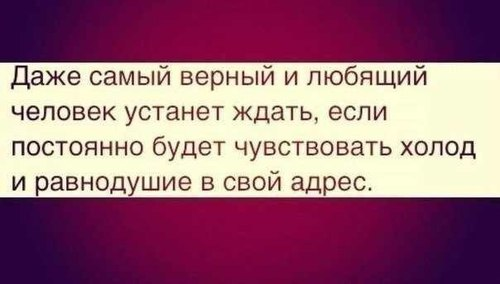

Мы живем в безумном мире, где каждый спешит успеть справиться со своими самыми «нужными» заботами. Все куда-то бегут, мчатся, торопятся, постоянно поглядывая на часы. С утра до вечера мы носим маску занятого человека, и лишь только дома, когда никто не видит, становимся теми, кто мы есть на самом деле.

<!--more-->

Приглядитесь к окружающим в общественном транспорте. Как правило, улыбаются единицы. Да и сами Вы, наверняка, сохраняете каменное выражение лица на протяжении большей части рабочего дня. А потом присмотритесь к лицам детей. Они живые, искренние, еще не отягощенные заботами. Дети еще не успели стать озлобленными трудоголиками, им не ведомы хроническая усталость и чувство ненависти к тому, что они делают.

Как много в вашем окружении людей, с которыми Вы всегда искренни? Не поверю, если много. Даже самые ярые холерики оставляют некоторые моменты своей яркой жизни только для близких. А теперь посчитайте, как часто Вы стараетесь сделать этим действительно близким людям приятно. Для чистоты эксперимента уберем дни рождения и праздники, в эти дни даже «знакомые» становятся к Вам чуточку добрее. Правда, подсчет заставил задуматься?

> Я не завидую чужому счастью
> И как умею, берегу свое,
> И если у друзей в душе ненастье,
> То это горе также и мое.
> Друзьям не расставляю я капканы,
> Не закрываю сердце на засов
> И не ищу в поступках их изъяны.
> Друзей люблю без всяких громких слов.
> Но кто-то мастер делать людям больно.
> И ненавистью душу бередя,
> Изводит всех, пусть даже и невольно,
> Но злобой душит самого себя!
> Таких людей я искренне жалею,
> В их душах не искрится Божий свет,
> Там вечный мрак запущенной аллеи,
> И светлых уголков , к несчастью, нет!
> Что может быть страшнее лицемерия?
> Всего важней — не обнищать душой!
> И я гоню и зависть, и безверие-
> Для этого не нужно быть святой!
> Но в истину одну я верю твердо:
> Отдашь добро — оно вернется вновь!
> Я слышу до последнего аккорда:
> «Людей согреет только лишь любовь!»
> Завидовать нельзя чужому счастью.
> Вы дорожите тем, что есть у вас.
> Любите! Говорите людям: «Здрасьте!»,
> Не отводя при этом ваших глаз.
> Я вам желаю, люди, быть добрее.
> Никто не вправе изменить судьбы!
> Жизнь коротка! Так наслаждайтесь ею
> Без зависти, без злобы, без вражды!
> <cite>Кира Крузис</cite>

Это замечательно стихотворение я нашел [здесь](http://www.proza.ru/2011/03/22/416). Именно оно и заставило задуматься над тем, как часто нам в жизни не хватает обычной доброты. Как часто мы делаем добрые дела, а в ответ получаем сухое «спасибо» либо принятие доброго дела как должного.

Ровно неделю назад я решил провести небольшой **эксперимент**: каждый день я начинал с улыбки самому себе в зеркале, а потом весь день старался дарить радость окружающим. Только добрые поступки, никакой лени в их совершении и тем более негативных эмоций. Помогал всем, кто в этом нуждался, старался развеселить всех, кто грустил. Но сегодня я сорвался, конкретно в данный момент чувствую себя как человек, проживший неделю впустую.

Люди, которые мне не близки, как друзья, но которых я считаю хорошими знакомыми, на удивление, очень легко отвечали на доброту взаимностью. Вот уж кому легко было поднять настроение, так это им. Порой хватало легкого комплимента в адрес загрустившей девушки либо простого обсуждения проблемы с потерявшим блеск в глазах парнем — и эти люди расцветали. Пусть ненадолго, пусть на минуту, но мне от этого было очень приятно.

Друзья же, которых у меня не так уж и много, реагировали как-то совсем иначе. Кто-то любые попытки поднять им настроение игнорировал, некоторые даже срывались на меня. Кто-то просто принимал поддержку как должное, само собой разумеющееся. Кто-то даже отношения со мной выяснять бросился по пустякам. И отчего-то начали делать это одновременно, ближе к концу недели.

Рассмотрим эти результаты с более-менее научной точки зрения. Я вообще верю в то, что все в мире — энергия в том или ином виде, будь то эмоции или материальные сущности. Пусть _E_затр — энергия, которую Вы тратите на совершение доброго или злого поступка. _E_отд — энергия отдачи, которую Вы получаете в ответ на этот поступок. В большинстве случаев эти энергии можно связать следующим соотношением:

_Е_отд = _e__E_затр.

Довольно простая формула, которая ярко показывает, что любое доброе дело вернется обратно сполна, и еще с придачей. Со злыми поступками ситуация такая же: сделал плохо — получил обратно еще больше.

Что же делать с людьми, которые отказываются принимать добро? Ничего, формула действует все так же эффективно. Добро, которое им дарится, греет душу его совершившему. Негатив же, который люди-«стены» отдают окружающим, когда-нибудь вернется к ним сполна.

Что я вынес для себя? Наверное, стоит пересмотреть свой круг общения. Нет, я ведь и сам не идеален, критиковать других всегда легче, чем посмотреть на себя со стороны. Добрых дел совершать меньше все равно не буду, ибо эгоист: я делаю добро, а оно возвращается в большем количестве — кто же от такого откажется? Но недавно наткнулся на одну картинку, которая понравилась:

Думаю, что я терпеливый. Очень терпеливый. Но время покажет.
