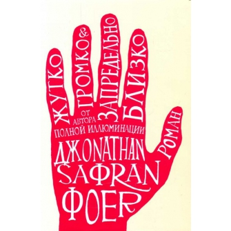
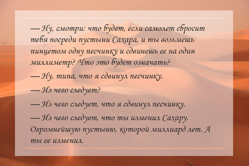

Не&nbsp;писал отзывы на&nbsp;книги со&nbsp;школы. Не&nbsp;было повода. А&nbsp;сейчас почему-то захотелось.

Знакомство с&nbsp;книгой **Джонатана Сафрана Фоера** сразу подсказывало, что это необычная книга. Согласитесь, интригующая обложка. И&nbsp;начинается книга с&nbsp;иллюстраций. Название первой главы&nbsp;&mdash; _&laquo;Ты чё?&raquo;_ - тоже приковывает внимание.
<!--more-->
Это трогательная история девятилетнего мальчика **Оскара Шелла**, потерявшего отца в&nbsp;трагедии 11&nbsp;сентября 2001&nbsp;года. Это грустная и&nbsp;долгая история отношений дедушки и&nbsp;бабушки Оскара. Это серия коротких, но&nbsp;ярких историй нескольких из&nbsp;472 человек по&nbsp;фамилии Блэк, проживающих в&nbsp;Нью-Йорке. Рассказ о&nbsp;поколениях, о&nbsp;страдании и&nbsp;смирении, о&nbsp;гениальности и&nbsp;детской наивности. Роман о&nbsp;жизни.

Возможно, мне повезло с&nbsp;изданием книги. Но&nbsp;задумка автора издательством &laquo;Эксмо&raquo; была передана шикарно. Использовать иллюстрации и&nbsp;играть с&nbsp;оформлением текста для придания роману пущего драматизма&nbsp;&mdash; гениально и&nbsp;действенно. Последние 24&nbsp;страницы книги&nbsp;&mdash; иллюстрации, вызывающие дрожь в&nbsp;теле.

Идеи, которые **Джонатан Сафран Фоер** пытался передать, используя частично эпистолярный жанр, частично жанр записей для дневника, не&nbsp;новы. В&nbsp;центре сюжета оказывается ребенок, который борется с&nbsp;собственным одиночеством и&nbsp;&laquo;гирями на&nbsp;сердце&raquo;. Параллельно развивается история жизни его бабушки и&nbsp;дедушки, в&nbsp;сосуществовании которых незримо присутствуют тяготы пережитого прошлого. Всему одна причина.

_&laquo;Я не&nbsp;хотел слышать про смерть. Все только о&nbsp;ней и&nbsp;говорили, даже когда говорили не&nbsp;о&nbsp;ней.&raquo;_

И&nbsp;пускай уже написаны тысячи книг на&nbsp;подобные тематики, автор смог передать эмоции своих персонажей по-новому, необычно и&nbsp;захватывающе. По&nbsp;глубине насыщенности эмоциями я&nbsp;могу сравнить эту книгу только с&nbsp;&laquo;Бойцовским клубом&raquo; Чака Паланика, но&nbsp;эмоции совершенно разные, сравнивать их&nbsp;будет неправильно.

А&nbsp;еще интересно из&nbsp;разных глав романа собирать пазл. Непонятные вначале детали обретают форму и&nbsp;получают свое объяснение только ближе к&nbsp;концу. Здорово, когда для чтения книги нужно напрягать память. Держит в&nbsp;тонусе, что&nbsp;ли.

Прочитал за&nbsp;три дня. Хотелось осилить быстрее, но&nbsp;помимо чтения, к&nbsp;сожалению, в&nbsp;реальном мире есть другие дела. Перечитаю, наверняка, еще не&nbsp;раз. И&nbsp;буду рекомендовать ее&nbsp;к&nbsp;прочтению всем тем своим знакомым, кто еще не&nbsp;успел стать фанатом этой книги.

_Спасибо за&nbsp;подарок!_
