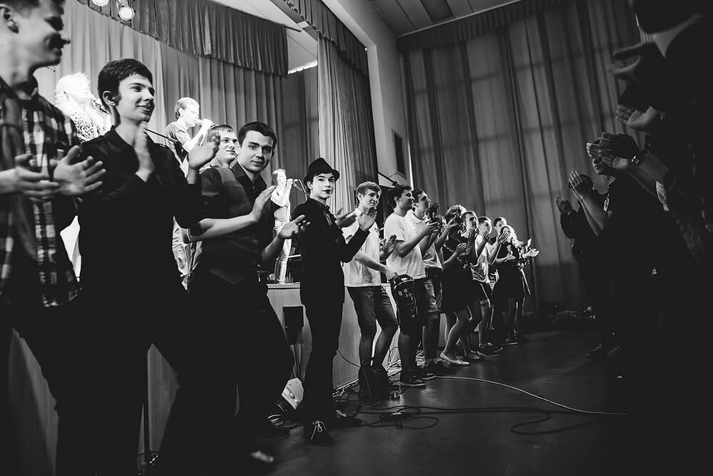
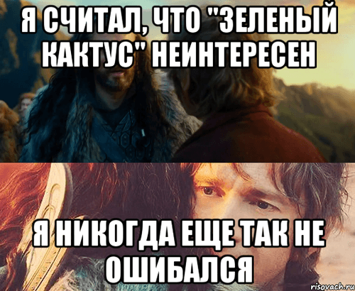
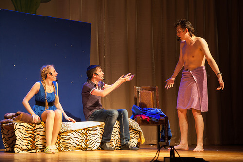
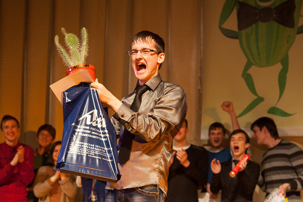

Часто ли вы творите? Не выполняете рутинную работу, не делаете что-то «на автомате», а именно **творите**. Я вот не могу похвастаться тем, что погружаюсь в истинное творчество достаточно часто, как того хочется. Но апрель этого года позволил зарядиться на много времени вперед: _«Зеленый кактус»_, _«Студенческая весна»_ — два различных по жанру фестиваля студенческого творчества, которые поглотили меня с головой, освободив, наконец, от оков системы, в которой мы живем.

<!--more-->

Итак, творчество.

Так уж получилось, что весна меня не радовала. Хобби, которое раньше приносило удовольствие, было поставлено на конвейер, и так любимое ранее создание графики постепенно надокучило. Кому понравится, что любимым делом занимаешься не по велению души?

Отдушина появилась в другом любимом деле: участии в подготовке концертов. Каждый, кто влюблен в сцену так же, как я, согласится, что это занятие позволяет забыть о многом, дав взамен море позитива и сильнейших эмоций. Так и было.

Первым этапом на пути к хорошему настроению стал конкурс СТЭМов **«Зеленый кактус 2014»**. Для тех, кто не знает: это межфакультетское соревнование между театралами на самую лучшую юмористическую миниатюру. Помимо выступления каждый факультет готовит видеоролик, так или иначе связанный с демонстрируемой программой.

Честно признаюсь, раньше я не считал этот конкурс чем-то особенным. Каждый год он проходит слишком близко к Студвесне, в сравнении с которой он слегка меркнет. Я никогда еще так не ошибался.

В этом году меня попросили побыть звукачом на выступлении нашей театральной команды _«Точка зрения»_. Ребята поставили миниатюру [«Свидание»](https://www.youtube.com/watch?v=l9bUrUAxbzA), в которой показали ситуацию приглашения второй половинки первый раз в общежитие с разных ракурсов. И шикарное во всех смыслах выступление все-таки нуждалось в соответствующем музыкальном сопровождении. Как показала практика, правильно подобранная музыка способна кардинально изменить впечатление от происходящего на сцене. Приятно, что ребята посчитали меня способным справиться с этой задачей.

Раскрою немного секретов. Несмотря на то, что сценарий и общая идея миниатюры вынашивались достаточно долго, полноценных репетиций у команды было крайне мало. Если сказать, что вся миниатюра была поставлена за 3 дня, то истина будет рядом. Большинство шуток придумывалось на ходу. А имени одного из главных персонажей (который в итоге оказался Геннадием), не знал никто вплоть до самого выступления, даже сам Геннадий :)

Хочется сказать «спасибо» троице, которая зарядила меня за время репетиций и самого выступления. Только они и смогли вытащить меня из того жуткого депрессняка, который охватил меня после неприятных мне событий накануне конкурса. Спасибо, Маша, Максим и Кирилл!

Началось выступление с потрясного [видео](https://www.youtube.com/watch?v=Jqprl5r4G2I), подготовленного нашими юмористами Вадимом Ткачевым и Сергеем Миско. Не каждый может так тонко подметить атмосферу, которая царит на кухне в студенческом общежитии. Ребятам это удалось. Посмотрите сами ;)

Показанная далее миниатюра, без лишней скромности, порвала зал. Тонкие моменты, которые ребята смогли подметить в жизни и вставить в сценарий, заходили на ура. Причем некоторые вещи, которые не планировались в качестве шуток, зал воспринял с еще большим восторгом. Не буду рассказывать вам сюжет, вы и сами можете [все увидеть](http://youtu.be/l9bUrUAxbzA?t=35m20s) своими глазами.

Не обошлось без «потерь». Одну шутку смазал звукач, то есть я, парочку — сами театралы. Но настроение зала от этого ни на градус не ухудшилось.

Выступления других факультетов, стоит отметить, были также на высоте. Поздравление театра ББК, которое шло вне конкурса, завело публику на весь концерт вперед. Джигурда наверняка запомнился многим:

> Пусть будет все у вас прекрасно,
> У вас сегодня юбилей.
> А кто завидует от злости,
> Пускай получит ...

Команде ФИТиУ, наверное, не повезло, что их тема частично была раскрыта театром ББК. Тот же Джигурда, та же Малышева. Юмор присутствовал в большом количестве, но все подается в сравнении.

ФРЭ подготовил очень философскую миниатюру. _«Чего вы все боитесь?»_ Действительно, чего мы все боимся? Джокер, спецэффекты, постановочные действия — все было на должном уровне.

ИЭФ, к сожалению, выступал после ФКСиС. Возможно до нас их выступление смотрелось бы более выигрышно. Так уж совпало, что шутки некоторые были очень похожи, да и место действия миниатюры оказалось тем же. Что называется, творческие люди мыслят одинаково. Ира и Настя отыграли здорово, молодцы.

ФКП отчего-то мне не очень запомнился. Они подняли философскую проблему зависимости людей от вещей, которые их окружают. И преподнесли ее достойно. Но то ли юмора не хватило, то ли игры актеров — ощущение недосказанности осталось. Это сугубо мое мнение.

Каков же результат?

_«Лучшая мужская роль»_ ушла Кириллу Чугаинову, так блистательно справившемуся с ролью самого себя. _«Лучшая женская роль»_ — Марии Марчук, чья пощечина Кириллу заставила улыбнуться даже самых искушенных зрителей. _«Лучший видеоролик»_ забрал факультет «ка-эс-и-эс». И **первое место** завоевал театр «Точка зрения», ФКСиС! Наша команда в этом году взяла почти все номинации, которые только были. Вот он, результат!

Почему же частью заголовка этой записи в моем скромном блоге является _«Счастье на сцене»_? Потому что именно в момент триумфа нашего факультета на конкурсе СТЭМов я осознал, что истинное счастье — радоваться общим успехам. Любые личные достижения меркнут перед победами дела, в которое вложили душу дорогие тебе люди. Пускай я сам лишь слегка поучаствовал в создании этого успеха, видеть счастливые глаза наших театралов — это тоже своего рода счастье.

Самое приятное в этом мероприятии было то, что, несмотря на его соревновательность, между факультетами не было вражды на сцене. Даже на «разборе полетов» от жюри после выступления никто не пытался задеть чей-то сценарий, указать на ошибки. Нет, этого не было. Было дружелюбие и взаимное уважение. И ради такой атмосферы я готов проводить все свое свободное время в кругу театралов. Потому что они другие, потому что они хорошие :)

_Продолжение следует..._
