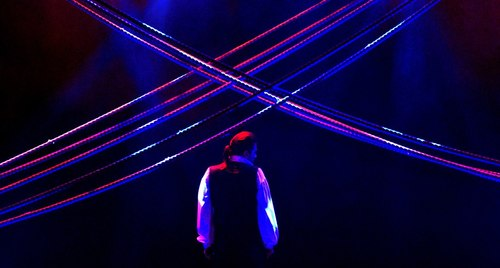
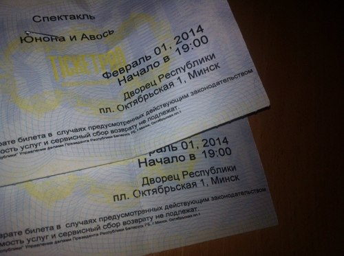
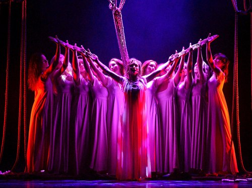
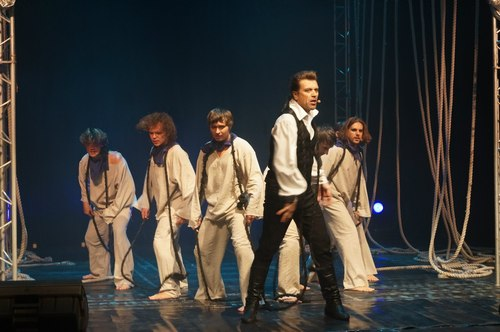

1806 год. Граф **Николай Петрович Резанов** после смерти своей жены добивается от государя Алексея Николаевича Румянцева права отправиться к берегам Калифорнии для развития российско-американской кампании по колонизации Америки. По приезду в Сан-Франциско граф влюбляется в дочь губернатора **Кончиту Аргуэльо**, где венчается с ней. Но срочные дела вынуждают Резанова вернуться в Россию, где под Красноярском он умирает от простуды, так и не добившись права женитьбы на католичке. Кончита ждет своего возлюбленного целых 35 лет, не веря отрывкам из речей моряков, проплывавших мимо берегов Калифорнии. Только после того, как в 1842 году английский путешественник Джон Симпсон сообщил Кончите точные сведения о том, как и когда умер граф Резанов, она дала обет молчания до конца жизни и ушла в монастырь.

<!--more-->

Такова трагичная история любви между двумя душами, разделенными десятками лет и тысячами километров. И таково краткое содержание бесподобной рок-оперы **Алексея Львовича Рыбникова** на либретто **Андрея Андреевича Вознесенского** «Юнона и Авось».

Еще в школьные годы мне очень понравился романс _«Я тебя никогда не забуду»_. И уже к выпускному классу количество прослушиваний записи рок-оперы 1988 года измерялось десятками. Песни были выучены наизусть, музыка прочно заседала в голове на недели. Видеозапись постановки Ленкома с Николаем Караченцевым в роли Резанова тоже была просмотрена не раз.

В 2012 году, а точнее 12 февраля, мне удалось попасть на новую постановку рок-оперы от театра Рыбникова во Дворце Республики. Как студент второго курса, я не мог позволить себе дорогие билеты в партере, хватило лишь на боковые места на балконе. Но уже тогда после просмотра меня еще неделю трясло от увиденного.

Полтора месяца назад совершенно случайно наткнулся в метро на объявление о том, что 1-2 февраля 2014 года театр Рыбникова снова в Минске, и снова с «Юноной и Авось». Билеты были куплены в течение двух дней, причем на этот раз позволил себе отжалеть со стипендии на билет в партер.

Вы можете спросить, зачем мне было идти туда еще раз. И я могу ответить, что если появится возможность сходить третий, четвертый, десятый раз — схожу! Передать словами те эмоции, которые творятся в душе во время просмотра этой, не побоюсь этого слова, великой рок-оперы, очень тяжело. Это и эйфория музыкального гурмана, и шок от возможностей голоса исполнителей, и мурашки по коже от пробирающих духовных песнопений. Сдобренное современной рок-обработкой, использованием световых и дымовых эффектов, действо на сцене поистине приковывает внимание зрителя до самого занавеса.

Отдельно хотелось бы отметить великолепные голоса актеров.

**Валерий Анохин**, исполнивший роль графа Резанова, вытягивал сложнейшие партии, не теряя артистичности и мощной харизмы. От многих слышал, что с Караченцевым все равно не сравнить. Я с вами не согласен, господа. Караченцев был безумно харизматичным Резановым, но по силе и гибкости вокала Валерий Анохин, на мой взгляд, выигрывает.

Духовные песнопения пробирали до дрожи. Да, Жанну Рождественскую так с 1988 года никто и не перепел, ее голос по-прежнему присутствует в постановке в арии Пресвятой Девы. Но все же сочетание церковного хора и электрогитары с ударной установкой — это бесподобное решение композитора. Музыка в буквальном смысле давила на грудную клетку. Честно признаюсь, несколько раз я даже закрывал глаза — настолько сильные ощущения были от песен.

> Мы — дети полдорог,
> Нам с вами имя — полдорожье.
> Никто из нас дороги не осилил,
> Да и была ль она, дорога впереди?

Ценности, затрагиваемые в «Юноне и Авось», остаются вечными. Любовь, согласие, преданность делу, отвага и честь — те идеалы, к которым нужно стремиться по сей день. И тот факт, что история людей, которые за эти ценности отдали жизни, увековечена в великой рок-опере, каждый раз собирающей полный зал зрителей, не может не радовать. Может, после ее просмотра каждый зритель станет хоть чуточку лучше, чуточку добрее.

> Дети двадцать первого столетья,
> Начался ваш новый век.
> Неужели вечно не ответит
> На вопрос согласья человек?
> Две души, несущихся в пространстве,
> Полтораста одиноких лет,
> Мы вас умоляем о согласьи,
> Без согласья смысла в жизни нет.
> Аллилуйя любви, Аллилуйя!

Любите друг друга и слушайте хорошую музыку ;)
