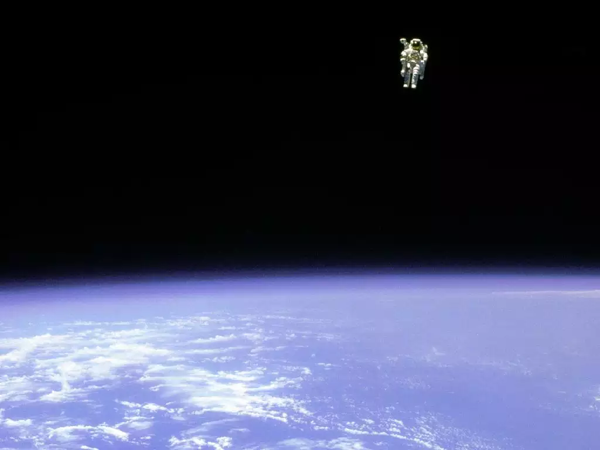
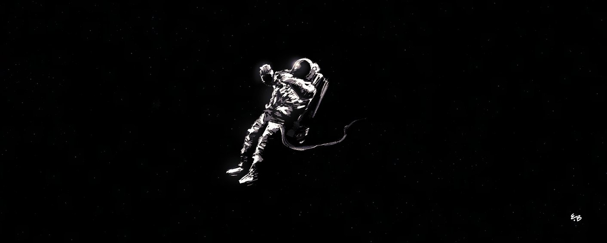

_Решил попробовать себя в новом жанре, а именно в написании рассказов. Критика и отзывы приветствуются._

<!--more-->

Один... Еще когда я был маленьким, отец научил простому приему успокаивать свои нервы: считать до десяти, глубоко вдыхая на каждый счет. Успокоиться сейчас просто необходимо. Не могу поверить, что я нахожусь в открытом космосе, без связи с экипажем, в миллионах километров от нашего корабля. Один, совсем один. Нет, так не бывает!

Два... Да где это видано, что экипаж забывает про своего инженера прямо перед гиперпрыжком? Забыть про того, кто вынужденно вышел в космос для ремонта ретранслятора. Если удастся кому-нибудь рассказать — не поверят. Не поверят, потому что так не бывает. Нет, меня спасут, не могли же они про меня действительно забыть. Так не бывает!

Три... Черт побери! Сегодня у меня вообще выходной! Заниматься ремонтом этого треклятого ретранслятора должен был кто-нибудь другой. В экипаже более пятнадцати инженеров, и меня вызвали только потому, что, видите ли, я лучше других разбираюсь в коммуникациях корабля. Еще бы, я же помогал их создавать. Но тогда какого черта про меня забыли? Отправили в открытый космос, потом абсолютно неожиданно запустили гипердвигатель, — и вот я здесь, покинутый экипажем идиотов, не удосужившихся проверить полное наличие личного состава на борту.

Четыре... А еще Ирен. Опустила градус настроения с самого утра. День, который я целиком и полностью хотел посвятить только ей, был испорчен неприятным разговором о ее переезде ко мне по возвращении на Землю. Точнее, о непереезде. Отдаешь человеку душу, стараешься стать для него лучшим во Вселенной, долго и упорно выстраиваешь отношения, и только решаешься сделать важный шаг — получаешь психологическую оплеуху в виде отказа. Какой уж тут отдых в выходной? Ох, если бы Ирен просто сказала «да», не согласился бы я так легко на невнятную просьбу главного механика помочь с ремонтом и не висел бы теперь между звездами в ожидании неизвестно чего. Почему, Ирен, почему нет? Почему именно сегодня?

Пять... Глубокий вдох... Нужно успокоиться. Проверить жизненные показатели. Сердцебиение учащенное. Еще бы, я ведь тут не крестиком вышиваю от скуки! Запасов кислорода в баллоне жизнеобеспечения хватит всего на пару часов, скафандр не предназначен для длительных выходов в космос. На сигналы аварийного маячка скафандра по-прежнему никто не отвечает. Значит, в радиусе пятисот тысяч километров нет ни одного корабля. Надеяться на их появление в межсистемном пространстве на краю исследованной части Вселенной глупо. Наш корабль остановился в этом квадранте исключительно для ремонта ненавистного мне ретранслятора. Надеяться можно только на себя. В стандартном ремонтном снаряжении есть импульсный резак, фотонная сварка, сверхпрочный трос из нанотрубок для крепления к корпусу корабля, в данный момент оборванный и бесполезный, как и весь ремкомплект. Разве что резак поможет. Точное попадание лазером в баллон жизнеобеспечения вызовет кислородную кому — и никаких переживаний, никаких проблем.

Шесть... Нельзя дать дурным мыслям заполнить разум. Всегда нужно надеяться на лучшее. Наверняка, капитану доложили о происшествии, и команда опытных штурманов прямо сейчас рассчитывает мои координаты для нового гиперпрыжка. Ирен, наверное, места себе не находит, грызет себя за неудачное утро. Весь экипаж в полной готовности спасти товарища, все стараются, как могут. Да, именно так и происходит. Есть же специальные протоколы на такой случай. Протоколы есть на все случаи, значит, и на этот есть. Мне не дадут умереть в открытом космосе, спасут. Может, даже, наградят за выдержку и терпение. У нас часто награждают, когда чувствуют свою вину. Ирен передумает, согласится жить вместе, мы наконец поженимся, вернемся к тихой жизни на Земле. И больше никакого космоса.

Семь... Если подумать, в сложившейся ситуации есть и моя вина. О том, что я решил заняться ремонтом ретранслятора вручную, без помощи ремботов, знал только мой помощник. Потому что выходить в космос после недавнего сбоя в операционной системе корабля было опасно, и вряд ли руководство одобрило бы этот необдуманный поступок. Но мне необходимо было побыть одному, наедине со своими мыслями. Только работа помогает мне сконцентрироваться, сосредоточиться на себе. Отказ Ирен нужно было осмыслить. Какова ирония. Хотел остаться наедине с собой? Пожалуйста. Вокруг на миллионы километров ни души. Думай, сколько угодно. Разбирайся в себе, раз есть возможность.

Восемь... Есть ли смысл надеяться на спасение? Вычисление моих координат займет у штурманов какое-то время, Если они уже начали этим заниматься, то вернуться в ту же точку, из которой ранее был совершен гиперпрыжок, из-за возмущения материи в этом квадранте все равно не удастся. Даже в самом благоприятном случае корабль остановится в десятках тысяч километров от моего местоположения. Пеленгация маячка и попытки добраться до меня — это время, которого с каждым вдохом остается все меньше. Шансы умереть от недостатка кислорода высоки как никогда. Затея с лазерным резаком уже не кажется такой глупой. А ведь за свою короткую жизнь я наломал столько дров! Потерял друзей, рассорился с родителями, сбежал от земных проблем в космос. Встреча с Ирен изменила меня, дала надежду на светлое будущее, на возможность все исправить... Теперь нет и этой надежды. Нет ничего. Остались только я и космос. Космос и я.

Девять... Сердцебиение в норме, дыхание ровное. Я не могу ничего изменить. Осталось только ждать. Не важно, чего: смерти или спасения. Лишь стыдно за последние слова, сказанные Ирен: «Поговорим позже». Ведь можем больше и не поговорить. Не узнает она о том, как сильно я ее люблю. О том, что даже в этой дурацкой ситуации я думал о ней. Нет, не оставлять надежду! Надеяться и ждать! Ирен любила повторять: «Улыбнись — и все получится». Я улыбаюсь. Себе, космосу, Вселенной, Ирен — улыбаюсь всему. Дождусь, чего бы мне это не стоило.

Десять.

