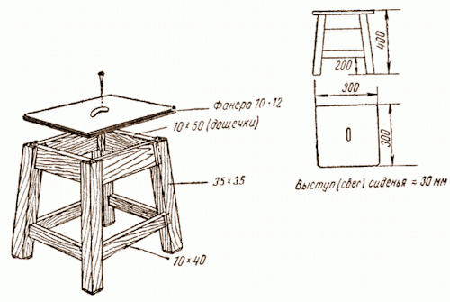
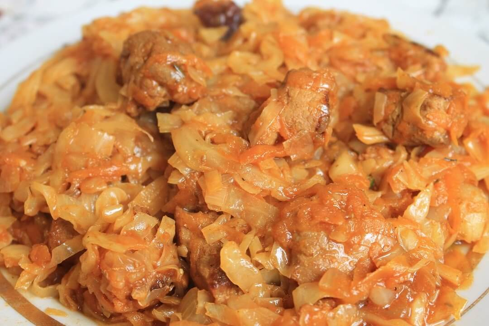
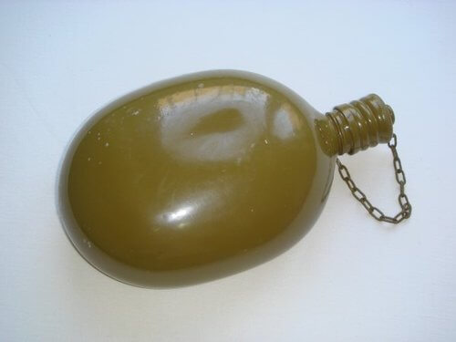
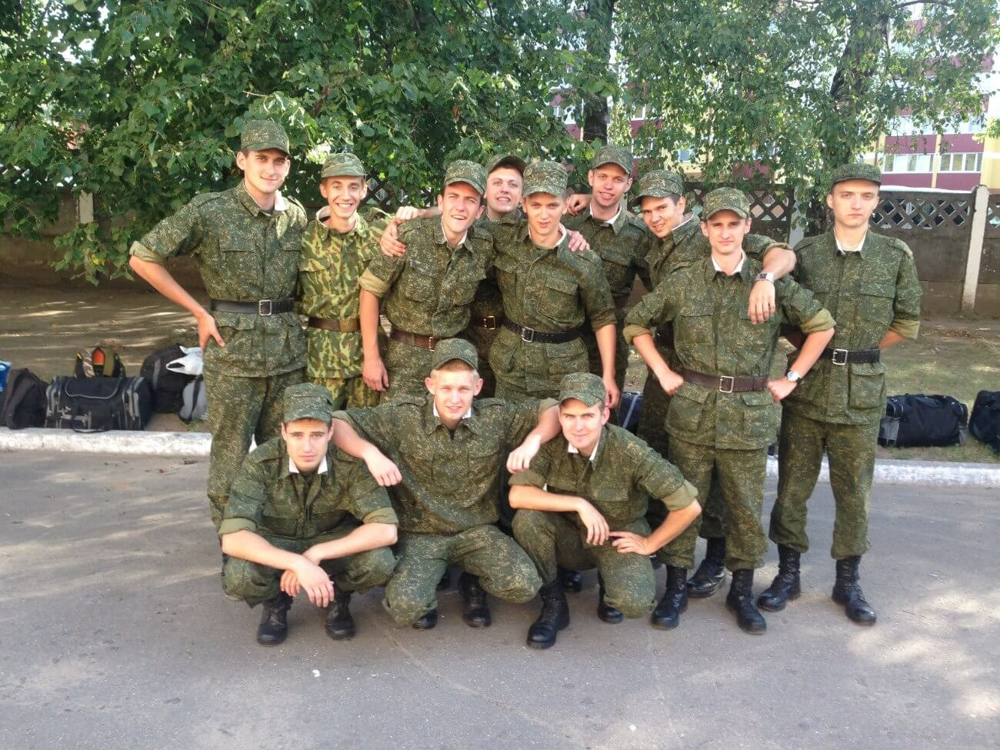
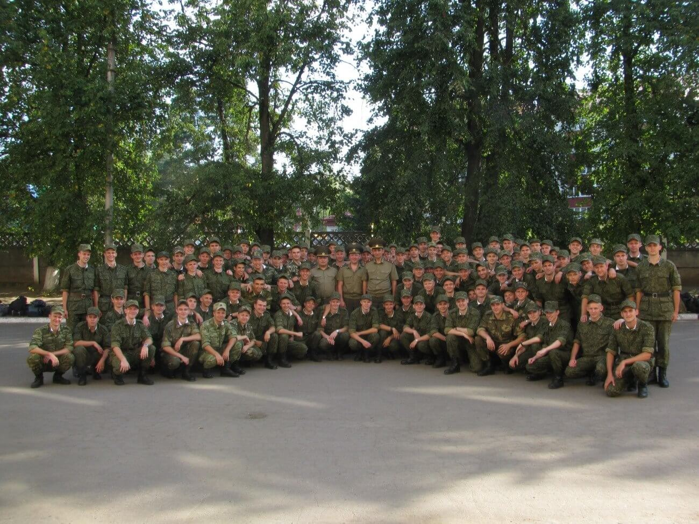

Песня, начинающаяся с этих строк, наверное, навсегда закрепилась в моей памяти. И тому есть причина.

<iframe width="800" height="450" id="youtube_iframe" src="https://www.youtube.com/embed/ggyafFuMrug" frameborder="0" allowfullscreen></iframe>

<!--more-->

## Пролог

Воскресное утро 6 июля. На остановке возле 86-й бригады связи под названием _«Военный городок»_ не продохнуть — повсюду молодые студенты в военной форме. Их глаза еще наполнены интересом и любопытством: что же ждет их за воротами КПП? Каждый строит свои предположения. Кто-то пересказывает истории знакомых, которые проходили военные сборы годом ранее, кто-то просто стоит и слушает. Всех ждет одно: 25 дней в окружении таких же, как они, студентов 4 курса, готовых сдать экзамен на звание лейтенанта запаса.

Для кого-то эти дни тянулись бесконечно долго и муторно. Кому-то они показались небольшим приключением в их жизни. Но каждому эти сборы что-нибудь дали, чему-то научили. И я расскажу вам, какие достоинства и недостатки, плюсы и минусы военных сборов за время их прохождения заметил я. Итак, поехали.

## Минусы

Начнем, пожалуй, с того, что все это время раздражало, не давало покоя и просто заставляло взгрустнуть. Минусы в большинстве своем связаны с тем, что в голове постоянно происходило сравнение гражданской жизни и жизни в казарме. Поэтому можете воспринимать следующие пункты как нытье привыкшего к комфорту студента.

 **Одни и те же люди**. Когда каждый день просыпаешься, бежишь на построение и видишь слева, справа и спереди одни и те же лица и затылки, становится уныло. Хочется какого-нибудь разнообразия. Пускай нас там и было около 120 человек, но основной круг общения все же был связан с ребятами из своего взвода. 17 человек, которые, возможно, стали чем-то ближе, но все же надоели до чертиков.

 **Сидение на табуретках**. Думаю, многие наслышаны о том, что в казарме нельзя лежать и сидеть на кроватях до отбоя и после подъема. Соответственно, табуретка для многих становится лучшим другом, кроватью, креслом и вешалкой. Очень важно было сразу ухватить себе крепкую и не расшатанную солдатами, чтобы потом не мучаться все сборы на подозрительно шатающейся табуретке каждый раз, когда на нее садишься. Да, еще со временем можно научиться так удобно на ней сидеть, что даже получается уснуть сидя. Однако к концу сборов такое сидение начинает слегка надоедать.

 **Нытье**. Постоянно приходилось слышать, как кто-то чем-то недоволен: то порядки глупые, то в столовой долго ожидать своей очереди, то Берегейко слишком громко храпит. Господа, вы ведь присягу давали. Неужели забыли про строчки в Уставе _«Солдат обязан стойко и мужественно переносить все тяготы и лишения воинской службы»_? Да, иногда бывает тяжело. Но то, как на трудности реагировать, решаете именно вы. Сам порой, конечно, жалуюсь на жизнь, не без греха, но стараюсь все же не давить своим настроением всех окружающих без разбору. В некоторых людях откровенно разочаровался, к сожалению.

 **Запрет на книги**. Не то, чтобы нам запретили читать вообще, нет. Разрешено было в тумбочке держать одну книгу. Но с учетом того количества времени, когда она спасала от скуки и отупения, одной книги очень-очень мало. Я свою растягивал, как мог, смаковал каждую страницу текста. Да, еще электронные читалки были под запретом, хотя некоторые не особо светясь все же пользовались этими замечательными девайсами.

 **Качество мебели**. Вроде, военным у нас государство деньги выделяет. Но вот обновить мебель в казарме как-то не получается. С одной стороны, оно, может, и правильно — нечего растить неженок, солдат должен уметь отдыхать в любых условиях. С другой стороны, когда тумбочка разваливается от открытия дверцы, хочется срочно заняться столярными работами.

 **Умывальники**. Думаю, все, кто умывался в дальней от входа уборной, запомнили уникальную особенность тамошних кранов: если включить один, на втором напор резко исчезнет. Из 10 работающих умывальников реально получалось пользоваться только четырьмя-пятью. По двое-трое человек на кран. Ничего не поделать, тяготы и лишения ведь.

 **Душ раз в неделю**. Самое большое испытание для чистоплотного организма. Была сначала возможность пользоваться ледяными душами на втором этаже, но после двух слегших в госпитале курсантов офицеры отчего-то запретили там мыться. Поэтому приходилось ждать банного дня, который устраивали раз в неделю, чтобы смыть с себя полноценно усталость и прочие последствия постоянного ношения формы в жаркую погоду.

 **Очереди в столовую**. Минус, конечно, относительный. Мне повезло служить в 6-м взводе. Из шести. А это значит, что во всех очередях, на всех построениях внимание нам уделялось по порядковому номеру, то есть последним. Поэтому пока первые взвода уже успевали покушать и отправиться в казарму заниматься своими делами, мы, как правило, только-только подходили к раздаточной, чтобы вкусить, наконец, чудеса армейской кухни. Правда, после того, как в наряде постоял сообразительный Максим Яблонский из нашего взвода, иногда мы стали заходить в столовую первыми или вторыми, за что ему искреннее огромное спасибо.

 **Просмотр «Панарамы»**. Каждый вечер с 21:00 до 21:30 все курсанты собирались возле телевизора и смотрели (или слушали), что же в мире происходит. Четыре года назад я полностью отказался от просмотра телевидения, а тут приходилось постоянно было в курсе тех ужасов, что творятся в соседних и не очень государствах.

 **Курсант по имени Никита**. Я вообще не очень люблю, когда в моем окружении появляются тезки. Сразу начинается путаница, неразбериха, кого позвали. И в этот раз было именно так. Более того, этот Никита еще и заместителем командира 5-го взвода был, то есть окликали его очень часто, а дергало и меня тоже. Хоть ты в Мефодия переименовывайся.

 **Исконно русская речь**. Ни для кого не секрет, что в армии используются специальные языковые конструкции для лучшего восприятия приказов и поручений. Нет, офицеры, стоит отметить, матом не ругались, почти. Зато насколько порой было неприятно общаться со своими же товарищами, которые обменивались крепким словцом направо и налево. Каюсь, сам иногда поддавался словоблудию. Может, в бою такая речь действительно действенна, но в мирной жизни хотелось бы все же разрушать свой мозг меньше.

 **День сурка**. Каждый день был именно таким. Подъем, зарядка, умывание, построение, занятия, обед, личное время, спортивный праздник, ужин, личное время, вечерняя прогулка, просмотр «Панарамы», вечерняя поверка, умывание, отбой. В выходные дни бывали легкие отклонения в виде увольнений, но все же разнообразие в распорядке дня не предусмотрено Уставом. И это очень сильно угнетало и отупляло.

## Плюсы

Пожалуй, хватит жаловаться на жизнь в условиях военных сборов. Ведь были же и позитивные моменты, причем немало. О них подробнее.

 **Терпение**. Дело в том, что на протяжении всех сборов у меня адски болела нога. Но сказать об этом я не мог, потому что меня либо положили бы в госпиталь, что означало бы невозможность периодически ездить в увольнения для работы в приемной комиссии университета, либо вообще сняли со сборов для лечения, что означало бы бесполезность двух лет обучения на военной кафедре. Приходилось терпеть. И, поверьте, это очень дисциплинирует.

 **Взаимовыручка**. У нас был очень дружный взвод. Пускай на гражданке мы общаемся довольно редко, на сборах все же взвод — это товарищи, которые друг другу помогают. Был, конечно, один гавнюк во взводе, который всегда был в стороне, но все остальные показали себя с лучшей стороны. Мнение о многих людях у меня изменилось в лучшую сторону.

 **Жизнь без техники**. Мы настолько привыкли к тому, что под рукой есть ноутбук, смартфон или хотя бы электронная читалка, что отказаться от всего этого довольно тяжело. Но я все же получил удовольствие от того, что голова не была забита информационным шумом, который несут с собой все девайсы. Принципиально не брал с собой телефон, оставлял на работе, хотя в личное время офицеры разрешали ими пользоваться. И если получится, хочу как-нибудь повторить этот опыт.

 **Аккуратность**. Заправка кроватей, ежедневная стирка, уход за формой — все это помогло привыкнуть к тому, что все должно быть аккуратно. Это и самому ведь приятно.

 **Сон**. Задумайтесь, сколько вы спите в сутки. А я спал не менее 8 часов — от отбоя в 22:00 до подъема в 6:00\. Впервые за многие месяцы я смог выспаться. Когда еще будет такая возможность в нашем суматошном мире ночных посиделок за работой и ранних подъемов на работу же?

 **Здоровый образ жизни**. Самое приятное в военных сборах. Каждое утро начиналось с зарядки, пробежки, турников. Причем я настолько привык к этим пробежкам, что продолжаю их уже на стадионе возле общежития. Почти каждый день после обеда проходили спортивные праздники. _«Что ни отдых, то активный, что ни праздник, то спортивный!»_ Форму помогает держать, бодрость духа сохраняет. Некоторые даже получили неплохой такой загар, которым вполне можно хвастаться.

 **Питание**. Возможно, нам повезло с местом прохождения сборов, но кормили отменно. Даже несмотря на то, что у меня не получилось обедать, завтрак и ужин были такими, что, в принципе, хватало. Пускай разнообразие блюд было относительным, никогда не оставлял ничего в тарелках, съедал все подчистую. И все это абсолютно бесплатно для студенческого кармана.

 **Внимательность**. Когда идешь в патруль, нужно быть готовым к тому, что кто-нибудь захочет дернуть печать на охраняемой машине, слить с нее бензин или, еще хуже, свинтить фару. Поэтому нужно было точно знать, где на какой машине сколько печатей и за что можно получить нагоняй от офицеров, если нести патруль недостаточно качественно.

 **Чувство ритма**. Ежедневные вечерние прогулки и строевые на плацу доводят природное чувство ритма до того, что даже при его полном отсутствии на начало сборов к их окончанию начинаешь ходить в ногу, будто служишь не первый год. Наш взвод даже хвалили пару раз. А как красиво мы прошли торжественным маршем после последнего нашего утреннего построения!

 **Расслабление мозга**. Думать не приходилось вообще. Да и зачем? О построениях сообщает дежурный, распорядок дня крепко засел в памяти еще в первую неделю, а мозговой активности выполнение приказов и поручений не предполагает. Может, это немного и отупляет, но все же как приятно придти после работы и ни о чем не думать. Лучше всяких медитаций.

 **Навыки кройки-шитья**. Раньше на подшивание у меня уходило около 15 минут. Сейчас 5 минут, причем даже качественнее и симпатичнее. А пуговицы вообще налету пришиваю. Полезный в жизни навык.

 **Фляга**. Самый нужный летом аксессуар. Хочется пить — протянул руку за спину, взял фляжку, попил. Главное, не забывать ее наполнять. Спасала не раз. Первое время после «дембеля» даже неудобно было, что за спиной ничего не болтается.

 **Адекватные офицеры**. Какими бы они строгими не были, лишнего себе никогда не позволяли. Да и строгость, честно говоря, была только самая необходимая. Конечно, не будешь же церемониться со 120 лбами, которые через час будут в руках держать настоящее оружие. Кстати, договориться с офицерами также можно было без проблем, если не можешь, например, в наряд заступить или вовремя из увольнения вернуться. Нам с ними повезло. А еще у нас был самый лучший старлей, бывший преподаватель истории, десантник, очень начитанный человек. Беседы на вольные темы с ним, думаю, запомнились всем слушателям.

 **Дали пострелять**. Из настоящего оружия. По настоящим мишеням. На настоящем полигоне. Ощущение непередаваемое: тут тебе и неловкость (не попал ни разу), и выросший за минуту стержень, и глухота на пару минут. Научиться бы еще по мишеням попадать — вообще счастью бы предела не было.

 **Дисциплина и субординация**. Я сторонник того, что субординация в жизни должна быть очень четкая. Иначе не миновать беды из-за самовольства. А дисциплина в армии — штука надежная, поддерживающаяся изнутри. Пускай иногда командиры перегибали палку, у нас во взводе даже на дружеском уровне поддерживалось разумное подчинение. И это хорошо.

 **Рай для педанта**. Действительно, выровненные под нитку кровати, тумбочки, даже полоски на одеялах. Табуретки одна возле другой, обувь у тумбочки носками к проходу, кители аккуратно сложены, полотенца только с правой стороны — настоящий рай для того, кто любит во всем порядок. Каюсь, я педант, потому мне эта особенность соблюдения Устава понравилась.

## Эпилог

31 июля, четверг, утро. Последний клич _«Рота, подъем!»_, последнее умывание в казарме, последнее построение. Кто-то собирает сумку с личными вещами, кто-то заправляет кровать, кто-то начищает ботинки на высоком берце (да-да, именно так правильно они называются). Тогда у всех в глазах была радость от того, что, наконец, они вернутся к привычной гражданской жизни без построений и вечерних прогулок. Но, думаю, нет-нет, да и вспомнит когда-нибудь с легкой ноткой ностальгической грусти матерый программист, как над территорией части раздавалось звонкое _«Кап-кап-кап, из ясных глаз Маруси капают слёзы на копье...»_

